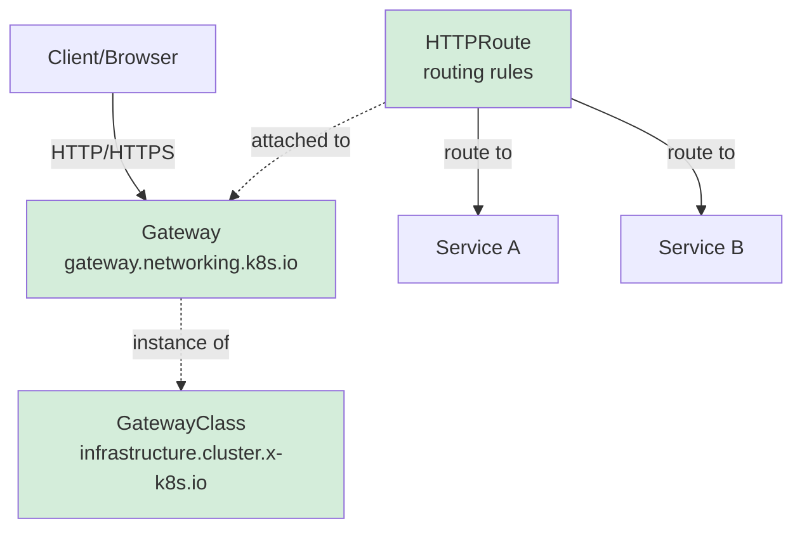

# Istio & Kubernetes 


## Agenda
  1. Aufzeichnungen aus yopad
     * [Aufzeichnungen](#aufzeichnungen)

  1. Einführung Kubernetes
     * [Aufbau Kubernetes](#aufbau-kubernetes)
     * [Pod starten](#pod-starten)
     * [Namespace/Arbeitsbereich konfigurieren](#namespacearbeitsbereich-konfigurieren)
     * [Beispiel-Applikation](#beispiel-applikation)
     * [Übung ReplicaSet(nicht für Produktion)](#übung-replicasetnicht-für-produktion)
     * [Übung Deployment](#übung-deployment)

  1. Services 
     * [Debug Netzwerkverbindung zu Pod/Service](#debug-netzwerkverbindung-zu-podservice)
     * [DNS Auflösung](#dns-auflösung)

  1. StatefulSet
     * [StatefulSet](#statefulset)
  
  1. ConfigMaps
     * [Exercise configmap](#exercise-configmap)

  1. Spickzettel kubectl Kubernetes
     * [Spickzettel kubectl](#spickzettel-kubectl)

  1. Grundlagen ServiceMesh & Istio
     * [Einführung in Istio & Service Mesh-Architekturen](#einführung-in-istio--service-mesh-architekturen)
     * [Warum ein Service Mesh?](#warum-ein-service-mesh)
     * [Herausforderung & Vorteile](#herausforderung--vorteile)
     * [Architektur & Komponenten von Istio](#architektur--komponenten-von-istio)
     * [Istio Ingress Gateway vs. Kubernetes Gateway API](#istio-ingress-gateway-vs-kubernetes-gateway-api)
     * [Ingress vs. Istio (sidecar)](#ingress-vs-istio-sidecar)
     * [Vergleich mit Linkerd, Cilium, Consul](#vergleich-mit-linkerd-cilium-consul)

  1. Setup Cluster
     * [Self-Service Cluster ausrollen](#self-service-cluster-ausrollen)
     * [Self-Service Cluster destroy](#self-service-cluster-destroy)
    
  1. Installation & Bereitstellung von Istio (Gateway API)
     * [Systemanforderungen & Kubernetes-Cluster-Vorbereitung](#systemanforderungen--kubernetes-cluster-vorbereitung)
     * [Installations-Config-Profile](#installations-config-profile)
     * [Istio-Installation mit istioctl und der IstioOperator - Resource - Legacy](#istio-installation-mit-istioctl-und-der-istiooperator---resource---legacy)
     * [Wie ändere ich die Config/Installation von istio - Beispiel egressGateway](#wie-ändere-ich-die-configinstallation-von-istio---beispiel-egressgateway)
     * [Istio Sidecar-Injection](#istio-sidecar-injection)
     * [Istio demo-app *bookinfo* installieren](#istio-demo-app-bookinfo-installieren)
     * Istio-Installation mit Helm
     * [Istio Proxy-Konzepte](#istio-proxy-konzepte)
     * [Deinstallation von Istio](#deinstallation-von-istio)

  1. Installation (ambient)
     * [istio ambient installieren](#istio-ambient-installieren)
     * [Install demoapp inkl verwendung von ambient](#install-demoapp-inkl-verwendung-von-ambient)
     * [Install waypoint](#install-waypoint)

  1. Steuerung des Netzwerkverhaltens in Istio (ohne Gateway API mit klassisch Istio API / sidecar) 
     * Virtual Services, Destination Rules & Gateway-API
     * [Übung: Header-basiertes Routing](#übung-header-basiertes-routing)
     * [Übung: Traffic-Shifting / Load-Balancing](#übung-traffic-shifting--load-balancing)
     * Load Balancing & Pfadbasiertes Routing
     * Erstellen von Routing- & Load-Balancing-Regeln

  1. Steuerung des Netzwerkverhaltens in Istio (mit Gateway API und ambient mode)
     * [Übung: Header-basiertes Routing](#übung-header-basiertes-routing)

  1. AuthorizationPolicy
     * [Deny für alles & erlaubt regeln](#deny-für-alles--erlaubt-regeln)
  
  1. Debug in Istio
     * [Debug in istio](#debug-in-istio)

  1. Sicherheit, Fehlertoleranz & Observability
     * [Sicherheit & Zero Trust mit Istio](#sicherheit--zero-trust-mit-istio)
     * [Was ist in istio deep-defense (defense in depth) ?](#was-ist-in-istio-deep-defense-defense-in-depth-)
     * [Service-zu-Service-Sicherheit mit mTLS (Mutual TLS) - Hintergründe & Analyse](#service-zu-service-sicherheit-mit-mtls-mutual-tls---hintergründe--analyse)
     * [Übung Zugriffskontrolle mit RBAC & JWT-Authentifizierung](#übung-zugriffskontrolle-mit-rbac--jwt-authentifizierung)
     * Istio Authorization Policies (ingress/egress Security)
     * Sichere Service-Kommunikation mit Istio konfigurieren

  1. Service Resilience & Fehlertoleranz
     * [Circuit Breaker](#circuit-breaker)
     * [Retries](#retries)
     * [Rate Limiting](#rate-limiting)
     * [Fehlerinjektion (z.B. 500er)](#fehlerinjektion-zb-500er)
     * [Chaos Engineering mit Istio](https://istio.io/latest/docs/examples/microservices-istio/production-testing/)
     * Belastungstests mit Fehlerinjektionen

  1. Monitoring, Logging & Observability
     * [Distributed Tracing mit Jaeger](#distributed-tracing-mit-jaeger)
     * Metriken & Dashboards mit Prometheus & Grafana
     * [Installation Prometheus Addon with Ingress](#installation-prometheus-addon-with-ingress)
     * [Metriken mit Prometheus auswerten](#metriken-mit-prometheus-auswerten)
     * [Installation Grafana Addon with Ingress](#installation-grafana-addon-with-ingress)
     * [Grafana Dashboards für istio](#grafana-dashboards-für-istio)
     * [Installaton Kiali // Installation](#installaton-kiali--installation)
     * [Visualisierung mit Kiali](#visualisierung-mit-kiali)
     * Analyse & Debugging von Service-Mesh-Daten

  1. Skalierung, Erweiterbarkeit & Performance-Optimierung
     * Skalierung von Istio & Performance-Optimierung
     * Sidecar-Overhead & Ressourcenoptimierung
     * Ambient Mesh (sidecar-less Istio für Performance-Gewinn)
     * Multi-Cluster- & Hybrid-Umgebungen mit Istio
     * Istio Federation & Cross-Cluster Traffic

  1. Erweiterte Routing-Techniken & Traffic-Optimierung
     * Canary Releases & Progressive Deployments
     * A/B-Tests & Traffic Mirroring
     * Blue-Green- und Canary-Deployments mit Istio

  1. Erweiterbarkeit & Automatisierung mit Istio
     * WebAssembly (Wasm) für Istio-Erweiterungen
     * [Wo läuft WASM (WebAssembly) im Rahmen von istio ?](#wo-läuft-wasm-webassembly-im-rahmen-von-istio-)
     * Automatisierung mit GitOps & ArgoCD
     * Eigene Istio-Erweiterungen mit WebAssembly schreiben

  1. FAQ & Best Practices
     * Zusammenfassung der wichtigsten Erkenntnisse
     * Diskussion von Best Practices für Enterprise-Anwendungen
     * Fragen & weiterführende Ressourcen

  1. Performance
     * [Performance Benchmark](#performance-benchmark)

  1. Helm
     * [Artifacthub.io](https://artifacthub.io/)
     * [Eigenes helm-chart erstellen](#eigenes-helm-chart-erstellen)

## Backlog 

  1. Installation & Bereitstellung von Istio (Gateway API)
     * [Systemanforderungen & Kubernetes-Cluster-Vorbereitung](#systemanforderungen--kubernetes-cluster-vorbereitung)
     * [Installations-Config-Profile](#installations-config-profile)
     * [Istio-Installation mit istioctl und der IstioOperator - Resource](#istio-installation-mit-istioctl-und-der-istiooperator---resource)
     * [Wie ändere ich die Config/Installation von istio - Beispiel egressGateway](#wie-ändere-ich-die-configinstallation-von-istio---beispiel-egressgateway)
     * [Istio Sidecar-Injection](#istio-sidecar-injection)
     * [Istio demo-app *bookinfo* installieren](#istio-demo-app-bookinfo-installieren)
     * Istio-Installation mit Helm
     * [Istio Proxy-Konzepte](#istio-proxy-konzepte)
     * [Deinstallation von Istio](#deinstallation-von-istio)

<div class="page-break"></div>

## Aufzeichnungen aus yopad

### Aufzeichnungen


```
Training Istio 
24.11. - 26.11.2025 

## Jochen bewerten 

https://g.page/r/CZcuN2PgwThxEAE/review


## Dokumentation 

### Übung 3.12. Jaeger 

https://github.com/jmetzger/workshop-istio-kubernetes/blob/main/istio/exercises/ambient/09-tracing-jaeger.md


### Übung 3.11.5 jaeger installieren 

https://github.com/jmetzger/workshop-istio-kubernetes/blob/main/istio/installation/addons/jaeger.md

### Übung 3.11 Kiali 

https://github.com/jmetzger/workshop-istio-kubernetes/blob/main/istio/installation/addons/kiali.md


### Übung 3.10  Prometheus 

https://github.com/jmetzger/workshop-istio-kubernetes/blob/main/istio/installation/addons/prometheus.md


### Übung 3.9. request routing

https://github.com/jmetzger/workshop-istio-kubernetes/blob/main/istio/exercises/gateway-api/02-exercise-request-routing.md


### Übung 3.8 install waypoint 

https://github.com/jmetzger/workshop-istio-kubernetes/blob/main/istio/installation/ambient/05-install-waypoint.md


### Übuung 3.7 demo - app installieren 

https://github.com/jmetzger/workshop-istio-kubernetes/blob/main/istio/installation/ambient/04-install-demo-app.md

### Übung 3.6 installation ambient 

https://github.com/jmetzger/workshop-istio-kubernetes/blob/main/istio/installation/ambient/03-install-with-istioctl-with-demo-profile.md
kubectl -n istio-system edit felixconfiguration default
## 
 bpfConnectTimeLoadBalancing: Disabled


### Übung 3.5 Installation 


### Übung 3.4 Aufräumen 

istioctl uninstall -y --purge 
kubectl delete ns bookinfo 


### Übung 3.3 logs von envoy 

https://github.com/jmetzger/workshop-istio-kubernetes/blob/main/istio/exercises/14-logging-in-envoy.md

### Übung 3.2 


### Übung 3.1. authorizationPolicy 

https://github.com/jmetzger/workshop-istio-kubernetes/blob/main/istio/exercises/12-deny-all-plus-rules.md


### Übung 2.9 bookinfo traffic-shifting

https://github.com/jmetzger/workshop-istio-kubernetes/blob/main/istio/exercises/04-traffic-shifting.md

### Analyse 

kubectl -n bookinfo exec "$(kubectl -n bookinfo get pod -l app=ratings -o jsonpath='{.items[0].metadata.name}')" -c ratings -- curl -sS productpage:9080/productpage | grep -o "<title>.*</title>"


kubectl -n bookinfo run -it --rm podtest  --image=busybox -- sh 

## In der Shell 
wget -O -  productpage:9080/productpage
wget -O -  productpage:9080/productpage | grep -o "<title>.*</title>"


https://github.com/jmetzger/workshop-istio-kubernetes

### Übung 2.8 bookinfo installieren 

https://github.com/jmetzger/workshop-istio-kubernetes/blob/main/istio/installation/04-install-demo-app-bookinfo.md

###  Übung 2.7 istiocl inject 

https://github.com/jmetzger/workshop-istio-kubernetes/blob/main/istio/exercises/01-exercise-injection.md

### Übung 2.6 istio installieren / istioctl und demo 

https://github.com/jmetzger/workshop-istio-kubernetes/blob/main/istio/installation/03-install-with-istioctl-with-demo-profile.md#schritt-1-istio-runterladen-und-installieren


### Info 2.5 istio performance 

https://github.com/jmetzger/workshop-istio-kubernetes/blob/main/istio/overview/performance-comparison-baseline-sidecar-ambient.md

### Info 2.4 istio Architektur

https://github.com/jmetzger/workshop-istio-kubernetes/blob/main/istio/overview/01-introduction.md


### Übung 2.3. helm

https://github.com/jmetzger/workshop-istio-kubernetes/blob/main/helm/exercises/04a-create-chart-my-app-gruppenarbeit.md


### Übung 2.2 secret 

kubectl create secret generic mariadb-secret --from-literal=MARIADB_ROOT_PASSWORD=11abc432 --dry-run=client -o yaml > 01-secrets.yml

kubectl apply -f 01-secrets.yml
kubectl describe secret mariadb-secret 
kubectl get secret mariadb-secret -o yaml 

## in dem deployment ändern configmap -> secretRef 
## auch den name in mariadb-secret und neu applien 
## Deployment 
kubectl apply -f 02-deploy.yml 

echo  MTFhYmM0MzI=  | base64 -d 
kubectl exec deployment/mariadb-deployment -- env


nur als Anhaltspunkt:
    https://github.com/jmetzger/workshop-istio-kubernetes/tree/main/kubectl-examples/kubectl-examples

### Übung 2.1 configmap 

https://github.com/jmetzger/workshop-istio-kubernetes/blob/main/kubectl-examples/06a-configmap-mariadb.md


### Übung 1.23 Solution 

https://github.com/jmetzger/workshop-istio-kubernetes/blob/main/kubectl-examples/04-ingress-nginx-with-hostnames.md#solution


### Übung 1.22 Schritt 1:
     https://github.com/jmetzger/workshop-istio-kubernetes/blob/main/kubectl-examples/04-ingress-nginx-with-hostnames.md#step-1-walkthrough   


### Info 1.21 Eure Subdomain 

*.tln1.do.t3isp.de 


### Übung 1.20 Wo ist der IngressController 

kubectl get ns 
kubectl -n ingress-nginx get all 

### Übung 1.19 type:LoadBalancer

## in 02-svc.yaml 
## type: NodePort ändern in type:LoadBalancer 
kubectl apply -f . 
kubectl get svc my-nginx 


### Übung 1.18 nodePort

kubectl -n ingress-nginx get svc 
cd 
cd manifests 
cd 04-service
nano 02-svc.yml 
## im Service -> ClusterIP auf NodePort 
kubectl apply -f .
kubectl get svc my-nginx  

## <external-ip>:32326 
## 164.90.236.159:32326 


### Übung 1.17 Statefulset

https://github.com/jmetzger/workshop-istio-kubernetes/blob/main/kubectl-examples/10-statefulset.md


### Übung 1.16 DNS Auflösung

https://github.com/jmetzger/workshop-istio-kubernetes/blob/main/kubernetes-networks/dns-resolution-services.md

### Übung 1.15 Debugging pod 

### rauslesen service ip und die pod ips 
kubectl describe svc my-nginx 

https://github.com/jmetzger/workshop-istio-kubernetes/blob/main/tipps-tricks/verbindung-zu-pod-testen.md

### Übung 1.14 Service 

https://github.com/jmetzger/workshop-istio-kubernetes/blob/main/kubectl-examples/03b-service.md#example-service

### Übung 1.13 explain 

kubectl explain deploy 
kubectl explain deploy.spec 

### Übung 1.12 Deployment 

https://github.com/jmetzger/workshop-istio-kubernetes/blob/main/kubectl-examples/03-nginx-deployment.md


#### Übung 1.11 replicaset 

https://github.com/jmetzger/workshop-istio-kubernetes/blob/main/kubectl-examples/01a-replicaset-nginx.md

#### Übung 1.10 get nodes

kubectl get nodes 
kubectl get nodes -o wide 

### Info 1.9 Replicaset 

https://github.com/jmetzger/training-kubernetes-einfuehrung/blob/main/kubectl-examples/01a-replicaset-nginx.md

### INfo 1.8. Beispielapplikation 

https://github.com/jmetzger/workshop-istio-kubernetes/blob/main/bauen-einer-webanwendung.md


### Übung 1.7. 

https://github.com/jmetzger/workshop-istio-kubernetes/blob/main/kubectl/kubectl-einrichten.md#arbeitsbereich-konfigurieren

### Übung 1.6 does not work 

https://github.com/jmetzger/workshop-istio-kubernetes/blob/main/kubectl/run-with-example.md#example-that-does-not-work

### Übung 1.5 pod describe 

kubectl describe po nginx 


### Übung 1.4 Pod starten 

https://github.com/jmetzger/workshop-istio-kubernetes/blob/main/kubectl/run-with-example.md
https://github.com/jmetzger/training-kubernetes-einfuehrung/blob/main/kubectl/run-with-example.md#example-that-does-work

### Übung 1.3 Funktion testen kubernetes

cd 
cd .kube
cat config 

kubectl cl<tab>
kubectl cluster-info 
kubecl config view 

### Übung 1.2 

https://github.com/jmetzger/workshop-istio-kubernetes/blob/main/istio/training-stack/install.md


### Übung 1.1


## Zeiten 

09.00 - 10:30 Block I 
10:30 - 10:45 Frühstückspause 
10:45 - 12:00 Block II 
12:00 - 13:00 Mittag 
13:00 -14:30 Block III 
14:30 - 14:45 Teatime
14:45 - 16:30 Block IV 


## Agenda 

Grundlagen & Installation von Istio
Einführung in Istio & Service Mesh-Architekturen
Warum Service Mesh? Herausforderungen & Vorteile
Architektur & Komponenten von Istio
Vergleich mit Linkerd, Cilium, ConsulInstallation

Bereitstellung von Istio
Systemanforderungen & Kubernetes-Cluster-Vorbereitung
Istio-Installation mit istioctl, Helm & Istio-Operator
Einführung in Sidecar Injection & Proxy-Konzepte

Steuerung des Netzwerkverhaltens in Istio
Virtual Services, Destination Rules & Gateway-API
Load Balancing, Header- & Pfadbasiertes Routing
Erstellen von Routing- & Load-Balancing-Regeln

Sicherheit, Fehlertoleranz & Observability
Sicherheit & Zero Trust mit Istio
Service-zu-Service-Sicherheit mit mTLS (Mutual TLS)
Zugriffskontrolle mit RBAC & JWT-Authentifizierung
Istio Authorization Policies (ingress/egress Security)
Sichere Service-Kommunikation mit Istio konfigurieren

Service Resilience & Fehlertoleranz
Circuit Breaker, Retries, Rate Limiting
Fehlerinjektion & Chaos Engineering mit Istio
Belastungstests mit Fehlerinjektionen

Monitoring, Logging & Observability
Distributed Tracing mit Jaeger
Metriken & Dashboards mit Prometheus & Grafana
Service-Visualisierung mit Kiali
Analyse & Debugging von Service-Mesh-Daten

(Skalierung, Erweiterbarkeit & Performance-Optimierung) - niedrige Prio 
Skalierung von Istio & Performance-Optimierung
Sidecar-Overhead & Ressourcenoptimierung
Ambient Mesh (sidecar-less Istio für Performance-Gewinn)
Multi-Cluster- & Hybrid-Umgebungen mit Istio
Istio Federation & Cross-Cluster Traffic

Erweiterte Routing-Techniken & Traffic-Optimierung
Canary Releases & Progressive Deployments
A/B-Tests & Traffic Mirroring
Blue-Green- und Canary-Deployments mit Istio

Erweiterbarkeit & Automatisierung mit Istio (niedrige Prio)
WebAssembly (Wasm) für Istio-Erweiterungen
Automatisierung mit GitOps & (ArgoCD)
Eigene Istio-Erweiterungen mit WebAssembly schreiben

FAQ & Best Practices
Zusammenfassung der wichtigsten Erkenntnisse
Diskussion von Best Practices für Enterprise-Anwendungen

```
Fragen & weiterführende Ressourcen


## Einführung Kubernetes

### Aufbau Kubernetes


### Overview 


### Components

#### Master (Control Plane)

##### Jobs

  * The master coordinates the cluster
  * The master coordinates the activities in the cluster
    * scheduling of applications
    * to take charge of the desired state of application 
    * scaling of applications 
    * rollout of new updates

##### Components of the Master 

###### etcd

  * Persistent Storage (like a database), stores configuration and status of the cluster 
  
###### kube-controller-manager  
  
  * In charge of making sure the desired state is achieved (done trough endless loops)  
  * Communicates with the cluster through the kubernetes-api (kube-api-server)

###### kube-api-server 

  * provides api-frontend for administration (no gui)
  * Exposes an HTTP API (users, parts of the cluster and external components communicate with it)
  * REST API
 
###### kube-scheduler 

  * assigns Pods to Nodes. 
  * scheduler determines which Nodes are valid placements for each Pod in the scheduling queue 
    ( according to constraints and available resources )
  * The scheduler then ranks each valid Node and binds the Pod to a suitable Node. 
  * Reference implementation (other schedulers can be used)
 
#### Nodes  

  * Nodes (Knoten) sind die Arbeiter (Maschinen), die Anwendungen ausführen
  * Ref: https://kubernetes.io/de/docs/concepts/architecture/nodes/

#### Pod/Pods 

  * pods are the smallest unit you can roll out on the cluster
  * a pod (basically another word for group) is a group of 1 or more containers
    * mutually used storage and network resources (all containers in the same pod can be reached with localhost)   
    * They are always on the same (virtual server)
    
### Control Plane Node (former: master) - components 

### Node (Minion) - components 

#### General 

  * On the nodes we will rollout the applications

#### kubelet

```
Node Agent that runs on every node (worker) 
its job is to download images and start containers 
```

#### kube-proxy 

  * Runs on all of the nodes (DaemonSet)
  * Is in charge of setting up the network rules in iptables for the network services 
  * Kube-proxy is in charge of the network communication inside of the cluster and to the outside
  
### ref:

  * https://www.redhat.com/en/topics/containers/kubernetes-architecture

### Pod starten


### Example (that does work)

```
## Show the pods that are running 
kubectl get pods 

## Synopsis (most simplistic example 
## kubectl run NAME --image=IMAGE_EG_FROM_DOCKER
## example
kubectl run nginx --image=nginx 

kubectl get pods 
## on which node does it run ? 
kubectl get pods -o wide 
```

### Example (that does not work) 

```
kubectl run foo2 --image=foo2
## ImageErrPull - Image konnte nicht geladen werden 
kubectl get pods 
## Weitere status - info 
kubectl describe pods foo2 
```

### Ref:

  * https://kubernetes.io/docs/reference/generated/kubectl/kubectl-commands#run

### Namespace/Arbeitsbereich konfigurieren

### Beispiel-Applikation


### Übung ReplicaSet(nicht für Produktion)


```
cd
mkdir -p manifests
cd manifests
mkdir 02-rs 
cd 02-rs
```

```
nano rs.yml
```

```
apiVersion: apps/v1
kind: ReplicaSet
metadata:
  name: nginx-replica-set
spec:
  replicas: 2
  selector:
    matchLabels:
      tier: frontend
  template:
    metadata:
      name: template-nginx-replica-set
      labels:
        tier: frontend
    spec:
      containers:
        - name: nginx
          image: nginx:1.21
          ports:
            - containerPort: 80
             

             
```

```
kubectl apply -f rs.yml
kubectl get all
```

### Übung Deployment


### Walkthrough 

```
cd
mkdir -p manifests
cd manifests
mkdir 03-deploy
cd 03-deploy 
nano deploy.yml 
```

```

## vi deploy.yml 
apiVersion: apps/v1
kind: Deployment
metadata:
  name: nginx-deployment
spec:
  selector:
    matchLabels:
      app: nginx
  replicas: 8 # tells deployment to run 2 pods matching the template
  template:
    metadata:
      labels:
        app: nginx
    spec:
      containers:
      - name: nginx
        image: nginx:1.21
        ports:
        - containerPort: 80
        
```

```
kubectl apply -f deploy.yml
kubectl get all
```

```
kubectl describe deploy nginx-deployment
```

### Optional: Change image - Version 

```
nano nginx-deployment.yml 
```


#### Version 1: (optical nicer)

```
## Ändern des images von nginx:1.22 in nginx:1.23
## danach 
kubectl apply -f . && watch kubectl get pods 
```

#### Version 2: 

```
## Ändern des images von nginx:1.22 in nginx:1.23
## danach 
kubectl apply -f .
kubectl get all 
kubectl get pods -w
```

## Services 

### Debug Netzwerkverbindung zu Pod/Service


### Situation 

```
Managed Cluster und ich kann nicht auf einzelne Nodes per ssh zugreifen
```

### Was wollen wir testen (auf der Verbindungsebene) ?


### Behelf: Eigenen Pod starten mit busybox 

```
## der einfachste Weg
kubectl run podtest --rm -it --image busybox 
```

```
## Alternative 
kubectl run podtest --rm -it --image busybox -- /bin/sh
```


### Example test connection 

```
## wget befehl zum Kopieren
ping -c4 10.244.0.99
wget -O - http://10.244.0.99
```

```
## -O -> Output (grosses O (buchstabe)) 
kubectl run podtest --rm -ti --image busybox -- /bin/sh
/ # wget -O - http://10.244.0.99
/ # exit 
```

### DNS Auflösung


### Exercise 

```
kubectl run podtest --rm -ti --image busybox
```

### Example with svc-nginx 

```
## in sh
wget -O - http://svc-nginx
wget -O - http://svc-nginx.jochen
wget -O - http://svc-nginx.jochen.svc
wget -O - http://svc-nginx.jochen.svc.cluster.local
```

### How to find the FQDN (Full qualified domain name) 

```
## in busybox (clusterIP)
#### Schritt 1: Service-IP ausfindig machen
wget -O - http://svc-nginx
## z.B. 10.109.24.227 

#### Schritt 2: nslookup mit dieser Service-IP
nslookup 10.109.24.227
## Ausgabe 
## name = svc-nginx.jochen.svc.cluster.local
```

## StatefulSet

### StatefulSet


### Schritt 1: 

```
cd 
mkdir -p manifests 
cd manifests
mkdir sts
cd sts 

```

```
nano 01-svc.yml
```

```
## vi 01-svc.yml 
## Headless Service - no ClusterIP 
## Just used for name resolution of pods
## web-0.nginx
## web-1.nginx 
## nslookup web-0.nginx
apiVersion: v1
kind: Service
metadata:
  name: nginx
spec:
  ports:
  - port: 80
    name: web
  clusterIP: None
  selector:
    app: nginx
```

```
nano 02-sts.yml
```

```
## vi 02-sts.yml 
apiVersion: apps/v1
kind: StatefulSet
metadata:
## name des statefulset wird nachher für den dns-namen verwendet 
  name: web
spec:
  serviceName: "nginx"
  replicas: 2
  selector:
    matchLabels:
      app: nginx
  template:
    metadata:
      labels:
        app: nginx
    spec:
      containers:
      - name: nginx
        image: registry.k8s.io/nginx-slim:0.8
        ports:
        - containerPort: 80
          name: web-nginx
```

```
kubectl apply -f .

```


### Schritt 2: Auflösung Namen.

```
kubectl run --rm -it podtester --image=busybox
```

```
## In der shell
## web ist der name des statefulsets 
ping web-0.nginx 
ping web-1.nginx 
exit
```

```
## web-0 / web-1 
kubectl get pods
kubectl get sts web
kubectl delete sts web 
kubectl apply -f .
kubectl run --rm -it podtest --image=busybox 

ping web-0.nginx 

```

### Referenz 

  * https://kubernetes.io/docs/tutorials/stateful-application/basic-stateful-set/

## ConfigMaps

### Exercise configmap


### Schritt 1: configmap 

```
cd 
mkdir -p manifests
cd manifests
mkdir cftest 
cd cftest 
nano 01-configmap.yml 
```

```
### 01-configmap.yml
kind: ConfigMap 
apiVersion: v1 
metadata:
  name: mariadb-configmap 
data:
  # als Wertepaare
  MARIADB_ROOT_PASSWORD: 11abc432
  VERSION: "4.1"
```

```
kubectl apply -f .
kubectl get cm
kubectl get cm mariadb-configmap -o yaml
```


### Schritt 2: Deployment 
```
nano 02-deploy.yml
```

```
##deploy.yml 
apiVersion: apps/v1
kind: Deployment
metadata:
  name: mariadb-deployment
spec:
  selector:
    matchLabels:
      app: mariadb
  replicas: 1 
  template:
    metadata:
      labels:
        app: mariadb
    spec:
      containers:
      - name: mariadb-cont
        image: mariadb:latest
        envFrom:
        - configMapRef:
            name: mariadb-configmap

```

```
kubectl apply -f .
## findet ersten Pod im Deployment und wechselt dort rein 
kubectl exec -it deployment/mariadb-deployment -- bash
```

```
## in der bash 
env | grep -i MARIADB
env | grep -i VERSION
exit 
```

### Important Sidenode 

  * If configmap changes, deployment does not know
  * So kubectl apply -f deploy.yml will not have any effect
  * to fix, use stakater/reloader: https://github.com/stakater/Reloader


## Spickzettel kubectl Kubernetes

### Spickzettel kubectl


### Allgemein 

```
## Zeige Information über das Cluster 
kubectl cluster-info 

## Welche api-resources gibt es ?
kubectl api-resources 

## Hilfe zu object und eigenschaften bekommen
kubectl explain pod 
kubectl explain pod.metadata
kubectl explain pod.metadata.name 

```

### Arbeiten mit manifesten 

```
kubectl apply -f nginx-replicaset.yml 
## Wie ist aktuell die hinterlegte config im system
kubectl get -o yaml -f nginx-replicaset.yml 

## Änderung in nginx-replicaset.yml z.B. replicas: 4 
## dry-run - was wird geändert 
kubectl diff -f nginx-replicaset.yml 

## anwenden 
kubectl apply -f nginx-replicaset.yml 

## Alle Objekte aus manifest löschen
kubectl delete -f nginx-replicaset.yml 


```

### Ausgabeformate 

```
## Ausgabe kann in verschiedenen Formaten erfolgen 
kubectl get pods -o wide # weitere informationen 
## im json format
kubectl get pods -o json 

## gilt natürluch auch für andere kommandos
kubectl get deploy -o json 
kubectl get deploy -o yaml 

## get a specific value from the complete json - tree 
kubectl get node k8s-nue-jo-ff1p1 -o=jsonpath='{.metadata.labels}'

```


### Zu den Pods 

```
## Start einen pod // BESSER: direkt manifest verwenden
## kubectl run podname image=imagename 
kubectl run nginx image=nginx 

## Pods anzeigen 
kubectl get pods 
kubectl get pod
## Format weitere Information 
kubectl get pod -o wide 
## Zeige labels der Pods
kubectl get pods --show-labels 

## Zeige pods mit einem bestimmten label 
kubectl get pods -l app=nginx 

## Status eines Pods anzeigen 
kubectl describe pod nginx 

## Pod löschen 
kubectl delete pod nginx 

## Kommando in pod ausführen 
kubectl exec -it nginx -- bash 

```

### Arbeiten mit namespaces 

```
## Welche namespaces auf dem System 
kubectl get ns 
kubectl get namespaces 
## Standardmäßig wird immer der default namespace verwendet 
## wenn man kommandos aufruft 
kubectl get deployments 

## Möchte ich z.B. deployment vom kube-system (installation) aufrufen, 
## kann ich den namespace angeben
kubectl get deployments --namespace=kube-system 
kubectl get deployments -n kube-system 

## wir wollen unseren default namespace ändern 
kubectl config set-context --current --namespace <dein-namespace>
```


### Referenz

  * https://kubernetes.io/de/docs/reference/kubectl/cheatsheet/

## Grundlagen ServiceMesh & Istio

### Einführung in Istio & Service Mesh-Architekturen


**Was ist ein Service Mesh?**
- Dedizierte Infrastrukturschicht für Service-zu-Service-Kommunikation
- Transparente Zwischenschicht ohne Code-Änderungen
- Zentrale Steuerung von Retry, Timeout, Verschlüsselung, Monitoring

**Istio im Überblick:**
- Open-Source Service Mesh (Google, IBM, Lyft)
- Nutzt Envoy-Proxies als Sidecars
- Fängt gesamten Netzwerkverkehr ab

### Vorher: Ohne Service-Mesh 


### Nachher: Mit Service-Mesh 


### Mermaid-Quelltexte 

```
graph TB
    subgraph "Ohne Service Mesh"
    direction LR
    A1[Service A] -.direkter Traffic.-> B1[Service B]
    A1 -.-> C1[Service C]
    B1 -.-> C1
    end
```
```
graph TB
    subgraph "Mit Service Mesh - Sidecar Pattern"
    direction TB
    
    subgraph Pod1["Pod A"]
    direction LR
    SA[Service A] --> EA[EnvoySidecar]
    end
    
    subgraph Pod2["Pod B"]
    direction LR
    SB[Service B] --> EB[EnvoySidecar]
    end
    
    subgraph Pod3["Pod C"]
    direction LR
    SC[Service C] --> EC[EnvoySidecar]
    end

    EA -->|mTLS| EB
    EA -->|mTLS| EC
    EB -->|mTLS| EC
    end
    
    style EA fill:#4285f4
    style EB fill:#4285f4
    style EC fill:#4285f4
    style Pod1 fill:#e8f4f8
    style Pod2 fill:#e8f4f8
    style Pod3 fill:#e8f4f8
```


### Warum ein Service Mesh?


**Probleme in Microservices:**
- Dutzende/Hunderte Services → komplexe Kommunikation
- Jeder Service muss selbst implementieren:
  - Circuit Breaking
  - Load Balancing
  - mTLS-Verschlüsselung
  - Distributed Tracing
  - Retry-Logik
- Inkonsistente Implementierung über Sprachen hinweg
- Hoher Wartungsaufwand

**Lösung:**
- Komplexität aus Anwendungscode → Infrastruktur
- Platform-Teams: zentrale Policies
- Entwickler: Fokus auf Business-Logik

### Vorher: Ohne ServiceMesh 


### Nachher: Mit ServiceMesh


```
graph TD
    subgraph "Problem: Jeder Service implementiert selbst"
    SJ[Service Java] --> |implementiert| LJ[Load Balancing<br/>Retry<br/>mTLS<br/>Tracing]
    SG[Service Go] --> |implementiert| LG[Load Balancing<br/>Retry<br/>mTLS<br/>Tracing]
    SP[Service Python] --> |implementiert| LP[Load Balancing<br/>Retry<br/>mTLS<br/>Tracing]
    end
    
    subgraph "Lösung: Service Mesh übernimmt"
    S1[Service Java] --> SM[Service Mesh]
    S2[Service Go] --> SM
    S3[Service Python] --> SM
    SM --> |zentral| F[Load Balancing<br/>Retry<br/>mTLS<br/>Tracing<br/>Security<br/>Observability]
    end
    
    style LJ fill:#ff6b6b
    style LG fill:#ff6b6b
    style LP fill:#ff6b6b
    style SM fill:#51cf66
    style F fill:#51cf66
```

### Herausforderung & Vorteile


**✅ Vorteile:**
- Automatische mTLS zwischen allen Services
- Traffic-Steuerung: Canary, Blue-Green, A/B-Testing
- Einheitliches Observability (Metrics, Traces, Logs)
- Zentrale Security-Policies
- Keine Code-Änderungen nötig

**⚠️ Herausforderungen:**
- Ressourcen-Overhead: CPU/RAM pro Sidecar
- Zusätzliche Latenz (Proxy-Hops)
- Steile Lernkurve
- Komplexeres Debugging

**Wann lohnt es sich?**
- Ab ~20-30 Services
- Hohe Security/Compliance-Anforderungen
- Multi-Team-Umgebungen


```
graph LR
    START{Service Mesh einsetzen?}
    
    START --> Q1{Wie viele Services?}
    Q1 -->|< 10| NEIN[❌ Overhead zu hoch]
    Q1 -->|10-20| Q2{Security wichtig?}
    Q1 -->|> 20| JA[✅ Empfohlen]
    
    Q2 -->|Ja| JA
    Q2 -->|Nein| MAYBE[⚠️ Abwägen]
    
    JA --> CHECK{Ressourcen verfügbar?}
    CHECK -->|Ja| GO[✅ Service Mesh nutzen]
    CHECK -->|Nein| PLAN[📋 Ressourcen planen]
    
    style NEIN fill:#ff6b6b
    style JA fill:#51cf66
    style GO fill:#51cf66
    style MAYBE fill:#ffd93d
```

### Architektur & Komponenten von Istio


**Data Plane:**
- Envoy-Proxies als Sidecars
- Fangen Traffic ab
- Setzen Policies durch

**Control Plane (istiod):**
- Konfigurationsverteilung
- Service Discovery
- Certificate Management
- Telemetrie-Sammlung

**Zusammenspiel:**
1. High-level Config (VirtualService, DestinationRule)
2. istiod übersetzt → Envoy-Config
3. Push an alle Proxies
4. Proxies setzen um

### Grafik (Komponenten) 


### Grafik (Ablauf) 


**Komponenten**

```
graph TB
    subgraph "Control Plane"
    ISTIOD[istiod]
    ISTIOD --> |1. Service Discovery| SD[Service Registry]
    ISTIOD --> |2. Config Management| CM[VirtualService<br/>DestinationRule<br/>Gateway]
    ISTIOD --> |3. Certificate Authority| CA[mTLS Certificates]
    ISTIOD --> |4. Telemetry| TEL[Metrics Collection]
    end
    
    subgraph "Data Plane - Pod 1"
    E1[Envoy Proxy] --> S1[Service A]
    end
    
    subgraph "Data Plane - Pod 2"
    E2[Envoy Proxy] --> S2[Service B]
    end
    
    subgraph "Data Plane - Pod 3"
    E3[Envoy Proxy] --> S3[Service C]
    end
    
    ISTIOD -->|Config Push| E1
    ISTIOD -->|Config Push| E2
    ISTIOD -->|Config Push| E3
    
    E1 <-->|mTLS| E2
    E2 <-->|mTLS| E3
    E1 <-->|mTLS| E3
    
    E1 -.->|Telemetry| ISTIOD
    E2 -.->|Telemetry| ISTIOD
    E3 -.->|Telemetry| ISTIOD
    
    style ISTIOD fill:#4285f4
    style E1 fill:#34a853
    style E2 fill:#34a853
    style E3 fill:#34a853
```

**Traffic Flow:**
```
sequenceDiagram
    participant Admin as Admin/DevOps
    participant Istiod as Control Plane (istiod)
    participant E1 as Envoy Proxy (Service A)
    participant E2 as Envoy Proxy (Service B)
    participant S1 as Service A
    participant S2 as Service B
    
    Admin->>Istiod: kubectl apply VirtualService
    Istiod->>Istiod: Validiert Config
    Istiod->>E1: Push Envoy Config
    Istiod->>E2: Push Envoy Config
    
    S1->>E1: Outbound Request zu Service B
    E1->>E1: Load Balancing, Retry Logic
    E1->>E2: mTLS verschlüsselter Traffic
    E2->>E2: Policy Check, Rate Limiting
    E2->>S2: Weiterleitung
    S2->>E2: Response
    E2->>E1: Response
    E1->>S1: Response
    
    E1-->>Istiod: Metrics & Traces
    E2-->>Istiod: Metrics & Traces
```

### Istio Ingress Gateway vs. Kubernetes Gateway API


### Istio Gateway


### Gateway API 


   * Achtung:  Beim Sidecar-Mode wird nachwievor VirtualService benötigt (aber nur intern innerhalb des Cluster), der Traffic
     * von ausserhalb wird über das Gateway dargestellt  

### Bild-Quelltext (Istio)

```
graph LR
    Client[Client/Browser]
    IG[Istio IngressGateway<br/>istio-ingressgateway Pod]
    GW[Gateway Resource<br/>istio.networking.v1beta1]
    VS[VirtualService<br/>routing rules]
    SvcA[Service A]
    SvcB[Service B]
    
    Client -->|HTTP/HTTPS| IG
    IG -.->|references| GW
    GW -.->|bound to| VS
    VS -->|route to| SvcA
    VS -->|route to| SvcB
    
    style IG fill:#e1f5ff
    style GW fill:#fff3cd
    style VS fill:#fff3cd
```

### Bild-Quelltext (Kubernetes Gateway API)



### Ingress vs. Istio (sidecar)


### Vergleich mit Linkerd, Cilium, Consul


| Feature | Istio | Linkerd | Cilium | Consul |
|---------|-------|---------|--------|--------|
| **Proxy** | Envoy (C++) | Rust-Proxy | eBPF (Kernel) | Envoy |
| **Komplexität** | Hoch | Niedrig | Mittel | Mittel |
| **Overhead** | Hoch | Niedrig | Sehr niedrig | Mittel |
| **Features** | Maximal | Basis | Netzwerk-fokus | Multi-Platform |
| **K8s-Native** | Ja | Ja | Ja | Teilweise |
| **Use Case** | Enterprise, viele Features | Einfachheit | Performance | VM + K8s |

**Kernunterschiede:**
- **Linkerd:** Einfach, schnell, weniger Features
- **Cilium:** eBPF = keine Sidecars, extrem performant
- **Consul:** Multi-Plattform (VMs, Bare Metal)
- **Istio:** Feature-Champion, größte Community


## Setup Cluster

### Self-Service Cluster ausrollen


  * ausgerollt mit terraform (binary ist installiert) - snap install --classic terraform 
  * beinhaltet
      1. 1 controlplane
      1. 3 worker nodes
      1. metallb mit ip's (IP-Adressen) der Nodes (hacky but works)
      1. ingress mit wildcard-domain:  *.tlnx.do.t3isp.de

### Vorbereitung seitens des Trainers

```
## /tmp/.env - Datei wurde vom Trainer vorbereitet
## Inhalt / export -> damit Umgebungsvariable 
export TF_VAR_do_token="DAS_TOKEN_FUER_DIGITALOCEAN"
```

```
Folgende Berechtigungen wurden für das Token gesetzt
```


   
### Walktrough 

  * Setup takes about 6-7 minutes
  * Hinweis: /tmp/.env beinhaltet Digitalocean Access Token der für das einrichten benötigt wird.

```
cd
git clone https://github.com/jmetzger/training-istio-kubernetes-stack-do-terraform.git install
cd install
cat /tmp/.env
source /tmp/.env
terraform init
terraform apply -auto-approve
```
### Hinweis

```
## Sollte es nicht sauber durchlaufen
## einfach nochmal
terraform apply -auto-approve

## Wenn das nicht geht, einfach nochmal neu
terraform destroy -auto-approve
terraform apply -auto-approve
```

### Testing for ingress-nginx 

  * Let us find out, if svc for nginx is available

```
kubectl -n ingress-nginx get svc
## use this url to access it through curl you should get 404
## e.g.
curl 46.101.239.161
```

### Self-Service Cluster destroy


```
cd 
cd install 
source /tmp/.env 
terraform destroy -auto-approve
```

## Installation & Bereitstellung von Istio (Gateway API)

### Systemanforderungen & Kubernetes-Cluster-Vorbereitung


### Hardware-Anforderungen

#### Master Node (Control Plane)
- **Minimum:** 2 CPU, 2 GB RAM, 20 GB Disk
- **Empfohlen:** 4 CPU, 8 GB RAM, 50 GB Disk
- **Schulung:** 2 CPU, 4 GB RAM, 30 GB Disk

#### Worker Node
- **Minimum:** 2 CPU, 2 GB RAM, 20 GB Disk
- **Empfohlen:** 4 CPU, 16 GB RAM, 100 GB Disk
- **Schulung:** 2 CPU, 4 GB RAM, 30 GB Disk

### Software-Voraussetzungen

#### Betriebssystem
- Ubuntu 20.04/22.04 LTS
- Debian 11/12
- RHEL/Rocky/Alma Linux 8/9
- 64-bit Architektur erforderlich

#### Container Runtime
- containerd (empfohlen)
- CRI-O
- Docker Engine (über cri-dockerd)

#### System-Tools
```bash
curl, wget, apt-transport-https, ca-certificates
```

### Netzwerk-Anforderungen

#### Ports Control Plane
- 6443: Kubernetes API Server
- 2379-2380: etcd
- 10250: Kubelet API
- 10259: kube-scheduler
- 10257: kube-controller-manager

#### Ports Worker Nodes
- 10250: Kubelet API
- 30000-32767: NodePort Services

### Cluster-Vorbereitung

#### System-Updates
```bash
apt update && apt upgrade -y
## oder
dnf update -y
```

#### Swap deaktivieren
```bash
swapoff -a
sed -i '/ swap / s/^/#/' /etc/fstab
```

#### Kernel-Module laden
```bash
cat <<EOL | tee /etc/modules-load.d/k8s.conf
overlay
br_netfilter
EOL

modprobe overlay
modprobe br_netfilter
```

#### Sysctl-Parameter
```bash
cat <<EOL | tee /etc/sysctl.d/k8s.conf
net.bridge.bridge-nf-call-iptables  = 1
net.bridge.bridge-nf-call-ip6tables = 1
net.ipv4.ip_forward                 = 1
EOL

sysctl --system
```

#### Firewall
- UFW/firewalld deaktivieren (Schulung)
- Oder: Benötigte Ports freischalten


lsmod | grep br_netfilter
```

### Installations-Config-Profile


  * istio verwendet verschiedene vorgefertigte Profile, die das Ausrollen (installieren) erleichtern
  * Diese können in istioctl verwendet werden, aber auch mit dem helm-chart

### Welcher Profile gibt es ? 

  * Es gibt deployment - profile und platform profile

### Übersicht der Deployment - Profile 

| Core components        | default | demo | minimal | remote | empty | preview | ambient |
|------------------------|---------|------|---------|--------|-------|---------|---------|
| istio-egressgateway    |         | ✓    |         |        |       |         |         |
| istio-ingressgateway   | ✓       | ✓   |         |        |       | ✓       |         |
| istiod                 | ✓       | ✓    | ✓       |        |       | ✓       | ✓       |
| CNI                    |         |      |         |        |       |         | ✓       |
| Ztunnel                |         |      |         |        |       |         | ✓       |

### Welches Deployment - Profile nehme ich am besten 

  * Für Productiion am besten Default (mit Sidecar) oder Ambient (für den Ambient - Modus)
  * Zum Testen / Üben demo (mit Sidecar), aber nicht ! für die Production. Schlecht für Performance (Hier ist ganz viel Debuggen und Tracing aktiviert)

### Übersicht Platform - Profile 

| Plattform | Beschreibung |
|-----------|--------------|
| gke | Sets chart options required or recommended for installing Istio in Google Kubernetes Engine (GKE) environments. |
| eks | Sets chart options required or recommended for installing Istio in Amazon's Elastic Kubernetes Service (EKS) environments. |
| openshift | Sets chart options required or recommended for installing Istio in OpenShift environments. |
| k3d | Sets chart options required or recommended for installing Istio in k3d environments. |
| k3s | Sets chart options required or recommended for installing Istio in K3s environments. |
| microk8s | Sets chart options required or recommended for installing Istio in MicroK8s environments. |
| minikube | Sets chart options required or recommended for installing Istio in minikube environments. |

### Reference:

  * https://istio.io/latest/docs/setup/additional-setup/config-profiles/

### Istio-Installation mit istioctl und der IstioOperator - Resource - Legacy


[Searching for installation with gateway api](#istio-installation-mit-istioctl-und-der-istiooperator---resource)


## Install with istioctl 

  * Most simplistic way
  * Doing the right setup is done with profiles
  * Interestingly it uses an compile-in helm chart  (see also: Show what a profile does)

### Hint for production 

  * Best option (in most cases) is default 

### in our case: Including demo (tracing is activated) 

  * Not suitable for production !!

### Show what a profile does 

```
istioctl manifest generate > istio-manifest.yaml
## If not profile is mentioned, it uses the default profile
## it does not use an operator 
cat istio-manifest.yaml | grep -i -A20 "^Kind" | less
## If you want you can apply it like so:
## kubectl apply -f istio-manifest.yaml 

```

### Installation including Demo 

> [!CAUTION]
> This profile (demo) enables high levels of tracing and access logging so it is not suitable for performance tests.

#### Schritt 1: istio runterladen und installieren 

```
cd 
## current version of istio is 1.28.0
curl -L https://istio.io/downloadIstio | sh -
ln -s ~/istio-1.28.0 ~/istio
echo "export PATH=~/istio-1.28.0/bin:$PATH" >> ~/.bashrc
source ~/.bashrc 
```

#### Schritt 2: bash completion integrieren 

```
cp ~/istio/tools/istioctl.bash ~/istioctl.bash
echo "source ~/istioctl.bash" >> ~/.bashrc
source ~/istioctl.bash
```

#### Schritt 2.5. See what it would install 

```
## dry-run
istioctl x precheck 
istioctl install -f  ~/istio/manifests/profiles/demo.yaml --dry-run
```

#### Schritt 3: Installation with demo (by using operator)

```
apiVersion: install.istio.io/v1alpha1
kind: IstioOperator
spec:
  components:
    egressGateways:
    - name: istio-egressgateway
      enabled: true
  values:
    profile: demo
```


```
istioctl install -f ~/istio/manifests/profiles/demo.yaml -y
```

#### Schritt 4: Let us check, if it is running 

```
kubectl -n istio-system get all
``` 

### Wie ändere ich die Config/Installation von istio - Beispiel egressGateway


  * Always !! mention the profile
  * Overlays work for: Properties and Scalars, but not for lists
  * To avoid problems always ! list the complete config

### Exercise: Enable egress gateway 

#### Step 1: Prepare istioOperator - config 

```
cd
mkdir -p manifests/istio 
cd manfifests/istio
nano istioOperator.yaml
```

```
apiVersion: install.istio.io/v1alpha1
kind: IstioOperator
spec:
  profile: demo
  components:
    ingressGateways:
    - name: istio-ingressgateway
      enabled: false       # keep this, so it does NOT come back
    egressGateways:
    - name: istio-egressgateway
      enabled: true        # turn this on
```


### Step 2: Dry-run first 

```
## See what is done 
istiocl install -f istioOperator.yaml --dry-run 
```

### Step 3: Install (Change now) 

```
istioclt install -f istioOperator.yaml 

```

### Istio Sidecar-Injection


### 1. Verzeichnis anlegen
```bash
mkdir -p ~/manifests/nginx
````

### 2. Nginx-Deployment erstellen

```bash
cat <<'EOF' > ~/manifests/nginx/nginx.yaml
apiVersion: v1
kind: Namespace
metadata:
  name: nginx-istio
---
apiVersion: apps/v1
kind: Deployment
metadata:
  name: nginx
  namespace: nginx-istio
  labels:
    app: nginx
spec:
  replicas: 1
  selector:
    matchLabels:
      app: nginx
  template:
    metadata:
      labels:
        app: nginx
    spec:
      containers:
      - name: nginx
        image: nginx:1.25
        ports:
        - containerPort: 80
---
apiVersion: v1
kind: Service
metadata:
  name: nginx
  namespace: nginx-istio
spec:
  selector:
    app: nginx
  ports:
  - port: 80
    targetPort: 80
EOF
```

### 3. Sidecar injizieren und anwenden

```bash
istioctl kube-inject -f ~/manifests/nginx/nginx.yaml
kubectl apply -f <(istioctl kube-inject -f ~/manifests/nginx/nginx.yaml)
```

### 4. Injection prüfen

```bash
kubectl get pods -n nginx-istio
```

Erwartetes Ergebnis: `READY 2/2`


### Istio demo-app *bookinfo* installieren


[Looking for installation with gateway api](istio/installation/gateway-api/04-install-demo-app-bookinfo.md)

### Überblick 


### Vorbereitung

```
kubectl create ns bookinfo
kubectl label namespace bookinfo istio-injection=enabled
```

### bookdemo app ausrollen 


```
kubectl -n bookinfo apply -f  ~/istio/samples/bookinfo/platform/kube/bookinfo.yaml
kubectl -n bookinfo get all 
```

### testen ob die app funktioniert 

```
kubectl -n bookinfo exec "$(kubectl -n bookinfo get pod -l app=ratings -o jsonpath='{.items[0].metadata.name}')" -c ratings -- curl -sS productpage:9080/productpage | grep -o "<title>.*</title>"
```

```
kubectl -n bookinfo run -it --rm podtest  --image=busybox -- sh 

## In der Shell 
wget -O -  productpage:9080/productpage
wget -O -  productpage:9080/productpage | grep -o "<title>.*</title>"
```

### App mit gateway (istio-ingress-gateway) nach aussen öffnen  

```
cd
mkdir -p manifests/bookinfo
cd manifests/bookinfo
```

```
nano istio-ingress.yaml 
```

```
apiVersion: networking.istio.io/v1
kind: Gateway
metadata:
  name: bookinfo-gateway
spec:
  # The selector matches the ingress gateway pod labels.
  # If you installed Istio using Helm following the standard documentation, this would be "istio=ingress"
  selector:
    istio: ingressgateway # use istio default controller
  servers:
  - port:
      number: 80
      name: http
      protocol: HTTP
    hosts:
    - "*"
---
apiVersion: networking.istio.io/v1
kind: VirtualService
metadata:
  name: bookinfo
spec:
  hosts:
  - "*"
  gateways:
  - bookinfo-gateway
  http:
  - match:
    - uri:
        exact: /productpage
    - uri:
        prefix: /static
    - uri:
        exact: /login
    - uri:
        exact: /logout
    - uri:
        prefix: /api/v1/products
    route:
    - destination:
        host: productpage
        port:
          number: 9080
```

```
kubectl -n bookinfo apply -f .
```

```
kubectl -n bookinfo get gateways.networking.istio.io
kubectl -n bookinfo get virtualservice  -o yaml 
```

```
kubectl -n istio-system get svc | grep istio-ingress
http://<external-ip>/productpage 
## or in your browser
```


### Istio Proxy-Konzepte

### Deinstallation von Istio


```
istioctl uninstall -y --purge
```

## Installation (ambient)

### istio ambient installieren


### Walkthrough 


```
istioctl install --set profile=ambient --skip-confirmation
kubectl get crd gateways.gateway.networking.k8s.io &> /dev/null || \
kubectl apply --server-side -f https://github.com/kubernetes-sigs/gateway-api/releases/download/v1.4.0/experimental-install.yaml
```

```
kubectl -n istio-system edit felixconfiguration default
## auf Disabled setzen
## bpfConnectTimeLoadBalancing: Disabled
```

### Läuft alles ? Alle Pods ready 

```
kubectl -n istio-system get pods
```

### Install demoapp inkl verwendung von ambient


### Überblick 


### Vorbereitung

```
kubectl create ns bookinfo
kubectl label namespace bookinfo istio.io/dataplane-mode=ambient
```

### bookdemo app ausrollen 


```
kubectl -n bookinfo apply -f  ~/istio/samples/bookinfo/platform/kube/bookinfo.yaml
kubectl -n bookinfo apply -f ~/istio/samples/bookinfo/platform/kube/bookinfo-versions.yaml

kubectl -n bookinfo get all 
```

### testen ob die app funktioniert 

```
kubectl -n bookinfo exec "$(kubectl -n bookinfo get pod -l app=ratings -o jsonpath='{.items[0].metadata.name}')" -c ratings -- curl -sS productpage:9080/productpage | grep -o "<title>.*</title>"
```

```
## Einfachere Variante 
kubectl -n bookinfo exec deployments/ratings-v1 -c ratings -- curl -sS productpage:9080/productpage | grep -o "<title>.*</title>"
```

### App mit gateway api nach aussen öffnen 

```
## That's what we do ....
cat  ~/istio/samples/bookinfo/gateway-api/bookinfo-gateway.yaml
```

```
kubectl -n bookinfo apply -f ~/istio/samples/bookinfo/gateway-api/bookinfo-gateway.yaml
kubectl -n bookinfo get gateways
kubectl -n bookinfo get httproutes -o yaml 
```

```
## not the external-ip from this output
## gateway automatically creates a service 
kubectl -n bookinfo get svc bookinfo-gateway-istio
```

```
http://<external-ip>/productpage 
## or in your browser
```

### Ref: 

  * https://istio.io/latest/docs/ambient/getting-started/deploy-sample-app/

### Install waypoint


### Walkthrough 

```
## Deploy it
istioctl waypoint apply -n bookinfo --enroll-namespace 
```

```
kubectl -n bookinfo get pods | grep way 
```

### Reference 

  * https://istio.io/latest/docs/ambient/usage/waypoint/#do-you-need-a-waypoint-proxy

## Steuerung des Netzwerkverhaltens in Istio (ohne Gateway API mit klassisch Istio API / sidecar) 

### Übung: Header-basiertes Routing


### Vorher (ohne request routing) 

  * Es werden alle Pods angezeigt, die das Label: app:reviews haben
  * D.h. jedesmal wenn ich die Seite öffne, wird eine andere Version angegezeigt (v1, v2 oder v3)
  * Service (selector: app:reviews)

```
kubectl -n bookinfo get svc reviews -o yaml
kubectl -n bookinfo get pods -l app=reviews --show-labels
```

### Übung (jetzt request - routing) 

**Voraussetzung:**

- Bookinfo-App läuft bereits im Namespace `bookinfo`
- Service Reviews ist definiert
- Es gibt 3 verschieden Pods an Reviews (v1, v2 und v3)
- Ingress/Gateway + `GATEWAY_URL` (IP: http://164.90.237.35/productpage aus der vorherigen Übung vorhanden

#### 0. Vorbereitung

```bash
mkdir -p ~/manifests/requests
cd ~/manifests/requests

## Die Destinationen-Versionen anlegen
cp -a ~/istio/samples/bookinfo/networking/destination-rule-all.yaml destination-rule-all.yaml
kubectl -n bookinfo apply -f destination-rule-all.yaml 
```

---

#### 1. VirtualService: Alle Requests → `reviews-v1`

```
nano reviews-v1.yaml 
```

```bash
apiVersion: networking.istio.io/v1
kind: VirtualService
metadata:
  name: reviews
spec:
  hosts:
  - reviews
  http:
  - route:
    - destination:
        host: reviews
        subset: v1
```

```
kubectl -n bookinfo apply -f reviews-v1.yaml 
kubectl -n bookinfo get virtualservice reviews -n bookinfo
```

```
## Anzeige im Browser - es ist immer die v1
http://164.90.237.35/productpage
```


---

#### 2. Adjust VirtualHost: User `jason` → `reviews-v2`, Rest → `reviews-v1`

```
cp -a ~/istio/samples/bookinfo/networking/virtual-service-reviews-test-v2.yaml virtual-service-reviews-test-v2.yaml
cat virtual-service-reviews-test-v2.yaml
```

```
kubectl -n bookinfo apply -f virtual-service-reviews-test-v2.yaml
kubectl -n bookinfo get vs reviews -n bookinfo -o yaml
```

---

### 3. Testen im Browser

```bash
echo "$GATEWAY_URL"
## Beispiel: http://<IP>:<PORT>

## 1. Im Browser: $GATEWAY_URL/productpage aufrufen (nicht eingeloggt oder anderer User)
##    → Reviews ohne Sterne (v1)

## 2. Im Browser: als User "jason" einloggen
##    → Reviews mit Sternen (v2)
```

(Optional: Kurztest per curl, ohne Login-UI):

```bash
for i in {1..3}; do
  curl -s "$GATEWAY_URL/productpage" | grep -o "rating" || true
done

for i in {1..3}; do
  curl -s -H "end-user: jason" "$GATEWAY_URL/productpage" | grep -o "rating" || true
done
```

---

### 4. Aufräumen

```bash
kubectl -n bookinfo delete vs reviews 
```

### Reference: 

  * https://istio.io/latest/docs/examples/bookinfo/#define-the-service-versions

### Übung: Traffic-Shifting / Load-Balancing


#### 0. Vorbereitung

```bash
mkdir -p ~/manifests/traffic-shifting
cd ~/manifests/traffic-shifting 

## Die Destinationen-Versionen anlegen
cp -a ~/istio/samples/bookinfo/networking/destination-rule-all.yaml destination-rule-all.yaml
kubectl -n bookinfo apply -f destination-rule-all.yaml 
```
#### 1. 100% Traffic -> reviews.v1 

```
cat ~/istio/samples/bookinfo/networking/virtual-service-all-v1.yaml
kubectl -n bookinfo apply -f ~/istio/samples/bookinfo/networking/virtual-service-all-v1.yaml
```

```
kubectl get vs -n bookinfo reviews -o yaml | head -n 30
```

#### 2. Testen 

```
## Seite öffnen
http://<deine-ip>/productpage

## Egal wie oft du die Seite lädst, es bleibt immer v1
```

#### 3. 50% (v1) /50% (v3) Traffic

```
cat ~/istio/samples/bookinfo/networking/virtual-service-reviews-50-v3.yaml
kubectl -n bookinfo apply -f ~/istio/samples/bookinfo/networking/virtual-service-reviews-50-v3.yaml
```

```bash
kubectl -n bookinfo get vs reviews -o yaml 
```

### 4. Testen 


```
## Seite öffnen
http://<deine-ip>/productpage

## Abwechselnd bei mehrmals laden v1 (keine Sterne) und v3 (sterne)
```

### 5. 100% auf v3 

```
cat ~/istio/samples/bookinfo/networking/virtual-service-reviews-v3.yaml
kubectl -n bookinfo apply -f ~/istio/samples/bookinfo/networking/virtual-service-reviews-v3.yaml
```


```bash
$BOOKINFO_URL="deine-ip"
for i in {1..10}; do
  curl -fsS "$BOOKINFO_URL/productpage" \
    | grep -c 'glyphicon-star"' \
    | awk '{print $1" Sterne"}'
done
```

#### 6. Aufräumen 

```
kubectl delete -n bookinfo vs reviews
```

### Reference:

 * https://istio.io/latest/docs/tasks/traffic-management/traffic-shifting/

## Steuerung des Netzwerkverhaltens in Istio (mit Gateway API und ambient mode)

### Übung: Header-basiertes Routing


### Vorher (ohne request routing) 

  * Es werden alle Pods angezeigt, die das Label: app:reviews haben
  * D.h. jedesmal wenn ich die Seite öffne, wird eine andere Version angegezeigt (v1, v2 oder v3)
  * Service (selector: app:reviews)

```
kubectl -n bookinfo get svc reviews -o yaml
kubectl -n bookinfo get pods -l app=reviews --show-labels
```

### Übung (jetzt request - routing) 

**Voraussetzung:**

- Bookinfo-App läuft bereits im Namespace `bookinfo`
- Service Reviews ist deniert
- Es gibt 3 verschieden Pods an Reviews (v1, v2 und v3)
- Ingress/Gateway + `GATEWAY_URL` (IP: http://164.90.237.35/productpage aus der vorherigen Übung vorhanden

#### 0. Vorbereitung

```bash
mkdir -p ~/manifests/requests
cd ~/manifests/requests

## aus der alten übung mit istio sidecar (classic)
rm -fR * 
## Die Service-Versionen anlegen
kubectl apply -f ~/istio/samples/bookinfo/platform/kube/bookinfo-versions.yaml bookinfo-versions.yaml
```

---

#### 1. HTTPRoute: Alle Requests → `reviews-v1`

```bash
cat <<EOF > ~/manifests/requests/httproute-reviews-v1.yaml
apiVersion: gateway.networking.k8s.io/v1
kind: HTTPRoute
metadata:
  name: reviews
  namespace: bookinfo
spec:
  parentRefs:
  - group: ""
    kind: Service
    name: reviews
    port: 9080
  rules:
  - backendRefs:
    - name: reviews-v1
      port: 9080
EOF

kubectl apply -f httproute-reviews-v1.yaml
kubectl -n bookinfo get httproute reviews -n bookinfo
```

```
## Anzeige im Browser - es ist immer die v1
http://164.90.237.35/productpage
```


---

#### 2. HTTPRoute anpassen: User `jason` → `reviews-v2`, Rest → `reviews-v1`

```bash
cat <<EOF > ~/manifests/requests/httproute-reviews-jason-v2.yaml
apiVersion: gateway.networking.k8s.io/v1
kind: HTTPRoute
metadata:
  name: reviews
  namespace: bookinfo
spec:
  parentRefs:
  - group: ""
    kind: Service
    name: reviews
    port: 9080
  rules:
  - matches:
    - headers:
      - name: end-user
        value: jason
    backendRefs:
    - name: reviews-v2
      port: 9080
  - backendRefs:
    - name: reviews-v1
      port: 9080
EOF

kubectl apply -f httproute-reviews-jason-v2.yaml
kubectl -n bookinfo get httproute reviews -n bookinfo -o yaml
```

---

### 3. Testen im Browser

```bash
echo "$GATEWAY_URL"
## Beispiel: http://<IP>:<PORT>

## 1. Im Browser: $GATEWAY_URL/productpage aufrufen (nicht eingeloggt oder anderer User)
##    → Reviews ohne Sterne (v1)

## 2. Im Browser: als User "jason" einloggen
##    → Reviews mit Sternen (v2)
```

(Optional: Kurztest per curl, ohne Login-UI):

```bash
for i in {1..3}; do
  curl -s "$GATEWAY_URL/productpage" | grep -o "rating" || true
done

for i in {1..3}; do
  curl -s -H "end-user: jason" "$GATEWAY_URL/productpage" | grep -o "rating" || true
done
```

---

### 4. Aufräumen

```bash
kubectl delete -f httproute-reviews-v1.yaml --ignore-not-found
kubectl delete -f httproute-reviews-jason-v2.yaml --ignore-not-found
```

### Reference: 

  * https://istio.io/latest/docs/examples/bookinfo/#define-the-service-versions

## AuthorizationPolicy

### Deny für alles & erlaubt regeln


### Step 0: Prep:

```
mkdir -p manifests/restrict-access
cd manifests/restrict-access
```

### Step 1: Disallow everything in this namespace 

```
nano 01-restrict-access.yaml
```

```
apiVersion: security.istio.io/v1beta1
kind: AuthorizationPolicy
metadata:
  name: deny-all
  namespace: bookinfo
spec: {}
```

```
kubectl apply -f 01-restrict-access.yaml 
```

#### Test in browser url 

```
## ip external-ip aus
## kubectl -n istio-system get svc | grep ingress
http://<ip>/productpage
```

### Step 2: Allow access from istio-gateway by namespace 

```
nano 02-from-istio-gateway.yaml
```

```
apiVersion: security.istio.io/v1beta1
kind: AuthorizationPolicy
metadata:
  name: allow-ingress-to-productpage
  namespace: bookinfo
spec:
  selector:
    matchLabels:
      app: productpage
  action: ALLOW
  rules:
  - from:
    - source:
        namespaces: ["istio-system"]
```

```
kubectl apply -f 02-from-istio-gateway.yaml
```


#### Test in browser -> url (now productpage should work) 

```
## Wenn das nicht funktioniert SHIFT + Relaod 
im browser: http://<ip>/productpage
```

```
## oder
curl http://<ip>/productpage 
```

### Step 3: Zugriff zu reviews von productpage erlauben 

```
nano 03-reviews-from-productpage.yaml
```

```
apiVersion: security.istio.io/v1beta1
kind: AuthorizationPolicy
metadata:
  name: allow-productpage-to-reviews
  namespace: bookinfo
spec:
  selector:
    matchLabels:
      app: reviews
  action: ALLOW
  rules:
  - from:
    - source:
        principals:
        - "cluster.local/ns/bookinfo/sa/bookinfo-productpage"
```

```
kubectl apply -f 03-reviews-from-productpage.yaml
```
#### Test in browser -> url (now productpage + reviews should work) 

```
## Wenn das nicht funktioniert SHIFT + Relaod 
im browser: http://<ip>/productpage
```

```
## oder
curl http://<ip>/productpage 
```

### Step 4: Zugriff auf details von productpage 

```
nano 04-details-from-productpage.yaml
```

```
apiVersion: security.istio.io/v1beta1
kind: AuthorizationPolicy
metadata:
  name: allow-productpage-to-details
  namespace: bookinfo
spec:
  selector:
    matchLabels:
      app: details
  action: ALLOW
  rules:
  - from:
    - source:
        principals:
        - "cluster.local/ns/bookinfo/sa/bookinfo-productpage"
```

```
kubectl apply -f 04-details-from-productpage.yaml
```

#### Test in browser -> url (now productpage + reviews + details should work) 

```
## Wenn das nicht funktioniert SHIFT + Relaod 
im browser: http://<ip>/productpage
```

```
## oder
curl http://<ip>/productpage 
```

### Step 5: Zugriff auf ratings von reviews 

```
nano 05-ratings-from-reviews.yaml 
```

```
apiVersion: security.istio.io/v1beta1
kind: AuthorizationPolicy
metadata:
  name: allow-reviews-to-ratings
  namespace: bookinfo
spec:
  selector:
    matchLabels:
      app: ratings
  action: ALLOW
  rules:
  - from:
    - source:
        principals:
        - "cluster.local/ns/bookinfo/sa/bookinfo-reviews"
```

```
kubectl apply -f 05-ratings-from-reviews.yaml
```

#### Test in browser -> url (now productpage + reviews + details should work) 

```
## Wenn das nicht funktioniert SHIFT + Relaod 
im browser: http://<ip>/productpage
```

```
## oder
curl http://<ip>/productpage 
```

### Step 6: Debug-Container zum Debuggen 

  * Debug Container in productpage - pod starten, um Verbindung zu pod -> Review zu debuggen 

```
kubectl -n bookinfo get pods | grep productpage
## diesen entsprechend hier verwenden 
kubectl -n bookinfo debug productpage-v1-54bb874995-rr7cv -it --image=busybox
```

```
## in der bash 
wget -O - http://reviews:9080/reviews/1
exit
```

>[NOTE:]
> Achtung ! Danach 1-2 Minuten warten !!! 
```
## AuthorizationPolicy rausnehmen
kubectl delete -f 03-reviews-from-productpage.yaml
```

```
kubectl -n bookinfo debug productpage-v1-54bb874995-rr7cv -it --image=busybox
```

```
## in der bash 
wget -O - http://reviews:9080/reviews/1
```

```
exit
```

### Step 6(V2 - Variante) 

```
kubectl -n bookinfo run -it podtester --image=busybox --overrides='{ "spec": { "serviceAccount": "bookinfo-productpage" }  }'
```

## Debug in Istio

### Debug in istio

## Sicherheit, Fehlertoleranz & Observability

### Sicherheit & Zero Trust mit Istio


### 1️⃣ **Strong Authentication (mTLS überall)**

* Jeder Pod bekommt automatisch ein **X.509-Zertifikat** (~SpiffeID).
* **Alle** Services sprechen untereinander **mutual TLS**.
* Istio überprüft:

  * Ist der Client wirklich der, der er vorgibt zu sein?
  * Passt die SPIFFE Identity?

👉 *Nichts darf unverschlüsselt, nichts darf anonym miteinander reden.*

---

### 2️⃣ **No implicit trust**

Ohne Policies gilt heute in Istio:
**Alles ist DENY, bis du ALLOW definierst.**

D. h. nur weil zwei Services im gleichen Namespace laufen, dürfen sie sich **nicht automatisch** gegenseitig aufrufen.

→ Du definierst explizit **RequestAuthentication** und **AuthorizationPolicy**.

---

### 3️⃣ **Fine-grained Authorization**

Istio entscheidet:

* **Wer** (Service identity / JWT claims)
* **darf** (ALLOW)
* **was** (HTTP-Verb, Pfad, Port)
* **wohin** (Service, Namespace)
* **von wo** (IP, Namespace, Principals)

Beispiel:
„Nur `reviews` darf `/ratings/*` aufrufen – aber nur GET, nicht POST.“

Das ist Zero-Trust.

---

### 4️⃣ **Policy enforcement auf Service-Ebene**

Alle Regeln gelten **zentral**, unabhängig vom Code des Services.
Das heißt:

* Keine ACLs mehr im Code
* Keine Bibliotheken anpassen
* Keine Firewall-Regeln auf Node-Ebene

→ Der Sidecar (oder Waypoint) erzwingt die Security.

---

### 5️⃣ **Identity-based Security (nicht IP-basiert)**

In Kubernetes ändern sich IPs permanent → unbrauchbar.

Istio arbeitet stattdessen mit **Identitäten**, z. B.:

```
spiffe://cluster.local/ns/bookinfo/sa/productpage
```

→ Diese Identität wird über mTLS geprüft

---

## 🧠 Merksatz

**Zero-Trust in Istio:
„Authenticate everything, authorize explicitly, trust nobody automatically.“**


* als **1-Folie** für dein Helm/Istio-Training
* als **Übung** mit echten Policies (ALLOW → DENY Prinzip)

### Was ist in istio deep-defense (defense in depth) ?


Istio secures your microservices at **multiple layers**, not just at one point.
Each layer is independent, so a failure in Layer A does *not* break Layer B or C.

Let’s walk through the layers:

## Diagramm 


---

## **1️⃣ Identity Layer — Strong Workload Identity (SPIFFE/SVID)**

Istio gives each workload a strong cryptographic identity:

* SPIFFE ID: `spiffe://cluster.local/ns/bookinfo/sa/reviews`
* Stored in an mTLS certificate
* Rotated automatically every few minutes/hours

Why this is depth:

✔ Even if the network is compromised, identity is still secure.
✔ Even if someone spoofs an IP, they *cannot spoof* the SPIFFE ID.

---

## **2️⃣ Encryption Layer — Mutual TLS (mTLS)**

Across **all service-to-service traffic**, Istio enforces:

* Encryption
* Authentication (client cert)
* Integrity (no tampering)
* Replay protection

mTLS is handled by the sidecar (or waypoint in Ambient).

Why this is depth:

✔ Even if a pod is compromised, an attacker cannot sniff traffic of other services.
✔ Even if a malicious service sends traffic, it must prove its identity cryptographically.

---

## **3️⃣ Transport Layer — L7-aware Authorization (RBAC at the mesh layer)**

Istio AuthorizationPolicies allow very fine-grained access control:

Examples:

* Only service A may call service B
* Only `GET /api/v1/orders` is allowed
* Only traffic with a specific JWT can reach a workload
* Deny all by default + whitelist exceptions

Why this is depth:

✔ Even if mTLS is on, you *still* get application-layer RBAC.
✔ Even if a token leaks, policies can enforce additional identity checks.

---

## **4️⃣ Credential Layer — JWT Authentication**

Istio allows binding of **end-user identity** (JWT/OIDC) into the mesh:

* Validate JWT
* Verify iss / aud
* Use JWKS URI to fetch signing keys
* Bind user identity to traffic and enforce RBAC

Why this is depth:

✔ Even if an attacker gets inside the cluster, they *still need valid end-user credentials*.
✔ Services cannot impersonate users.

---

## **5️⃣ Network Layer — Ingress & Egress security**

Istio can enforce:

#### Ingress:

* TLS termination
* JWT validation
* Rate limiting
* Web Application Firewall integration (Envoy filters)

#### Egress:

* Strict allowlists
* TLS origination
* Domain-based restrictions

Why this is depth:

✔ Even if an internal service is compromised, it cannot exfiltrate data (egress controls).
✔ Even if the user-facing API is attacked, gateway protections apply before workload.

---

## **6️⃣ Observability Layer — Zero-effort logging + tracing**

Istio gives:

* Distributed tracing
* Access logs (source, destination, identity)
* Metrics per service / route / error code
* mTLS metric visibility

Why this is depth:

✔ Even if someone tries to bypass security, you see clear traces.
✔ Unauthorized or weird traffic stands out immediately.

---

## **7️⃣ Policy Layer — Rate limiting, Fault injection, Circuit breaking**

Istio uses Envoy to enforce:

* Retry budgets
* Local or global rate limits
* Timeouts
* Circuit breakers
* Head-of-line attack protection

Why this is depth:

✔ Even if traffic is valid but malicious (DoS), rate limits protect workloads.
✔ Segments failure domains so one service cannot overload another.

---

## **8️⃣ Workload Layer — Sidecar isolation (Classic Istio Mode)**

In sidecar mode:

* Workloads can’t talk directly to the network
* Envoy controls all outbound and inbound traffic
* Pod cannot bypass mTLS or policies (unless sysadmin-level access)

Why this is depth:

✔ Even if app code is vulnerable, the network guardrail remains intact.
✔ Compromised code ≠ compromised network.

(With Ambient mode, this moves to per-node waypoints; same idea but different architecture.)

---

## **Summary — Istio’s Defense in Depth**

| Layer                    | Purpose                     | Benefit                                |
| ------------------------ | --------------------------- | -------------------------------------- |
| **mTLS**                 | Encryption + authentication | Prevent sniffing + spoofing            |
| **SPIFFE identities**    | Strong workload identity    | Prevent impersonation                  |
| **AuthZ policies**       | L7 firewall                 | Prevent unauthorized access            |
| **JWT Rules**            | End-user identity           | Stop token reuse / user spoofing       |
| **Ingress/Egress rules** | Cluster edge security       | Stop data exfil / limit attack surface |
| **Rate limits / CBs**    | Traffic control             | Prevent overload attacks               |
| **Sidecar isolation**    | Network control             | Prevent bypass                         |
| **Observability**        | Full visibility             | Detect attacks early                   |

Together, these layers form a **mesh-level, enterprise-grade security architecture** — which is exactly what *Defense in Depth* means.

---

If you want, I can also prepare:

🔹 A diagram of Istio’s Defense-in-Depth layers
🔹 An exercise for trainees to explore each layer
🔹 A comparison: **Istio Defense in Depth vs Kubernetes NetworkPolicies**
🔹 How to explain it to a beginner / trainee group

Just tell me, Sunshine!

### Service-zu-Service-Sicherheit mit mTLS (Mutual TLS) - Hintergründe & Analyse


### Übung Zugriffskontrolle mit RBAC & JWT-Authentifizierung


### Step 0: Preparation 

```
cd
mkdir -p manifests/jwt
cd manifests/jwt 
```

### Step 1: Create http-bin and curl workloads 

```
kubectl create ns foo
kubectl apply -f <(istioctl kube-inject -f ~/istio/samples/httpbin/httpbin.yaml) -n foo
kubectl apply -f <(istioctl kube-inject -f ~/istio/samples/curl/curl.yaml) -n foo
```

### Step 2: Can we connect ? 

```
kubectl exec "$(kubectl get pod -l app=curl -n foo -o jsonpath={.items..metadata.name})" -c curl -n foo -- curl http://httpbin.foo:8000/ip -sS -o /dev/null -w "%{http_code}\n"
```

### Step 3: Create a RequestAuthentication 

```
nano 01-ra.yml 
```

```
apiVersion: security.istio.io/v1
kind: RequestAuthentication
metadata:
  name: "jwt-example"
  namespace: foo
spec:
  selector:
    matchLabels:
      app: httpbin
  jwtRules:
  - issuer: "testing@secure.istio.io"
    jwksUri: "https://raw.githubusercontent.com/istio/istio/release-1.28/security/tools/jwt/samples/jwks.json"
```

```
kubectl apply -f . 
```

### Step 4: Check with an invalid jwt 

  * Invalid is restricted, so we do not get acces (no 200) 

```
kubectl exec "$(kubectl get pod -l app=curl -n foo -o jsonpath={.items..metadata.name})" -c curl -n foo -- curl "http://httpbin.foo:8000/headers" -sS -o /dev/null -H "Authorization: Bearer invalidToken" -w "%{http_code}\n"
```

### Step 5: But: without a jwt -> its work 

  * ... Because ! -> There is no AuthorizationPolicy

```
kubectl exec "$(kubectl get pod -l app=curl -n foo -o jsonpath={.items..metadata.name})" -c curl -n foo -- curl "http://httpbin.foo:8000/headers" -sS -o /dev/null -w "%{http_code}\n"
```

### Step 6: We create an AuthorizationPolicy 

>[!NOTE]
>requestPrincipal set to testing@secure.istio.io/testing@secure.istio.io. Istio constructs the requestPrincipal by combining the iss and sub of the JWT token with a / separator.

```
nano 02-ap.yml
```

```
apiVersion: security.istio.io/v1
kind: AuthorizationPolicy
metadata:
  name: require-jwt
  namespace: foo
spec:
  selector:
    matchLabels:
      app: httpbin
  action: ALLOW
  rules:
  - from:
    - source:
       requestPrincipals: ["testing@secure.istio.io/testing@secure.istio.io"]
```

```
kubectl apply -f 02-ap.yml
```

### Step 7: Test access 

  * jwt consists of 3 parts
    * HEADER / PAYLOAD / SIGNATURE
    * Each part is base64 encoded
  * cut -d. -f2 -> gets the 2nd part -> the payload 
   
```
## This is the way we get the token
TOKEN=$(curl https://raw.githubusercontent.com/istio/istio/release-1.28/security/tools/jwt/samples/demo.jwt -s) && echo "$TOKEN" | cut -d '.' -f2 - | base64 --decode
```

```
echo $TOKEN
```

```
## Testing with allowed jwt
kubectl exec "$(kubectl get pod -l app=curl -n foo -o jsonpath={.items..metadata.name})" -c curl -n foo -- curl "http://httpbin.foo:8000/headers" -sS -o /dev/null -H "Authorization: Bearer $TOKEN" -w "%{http_code}\n"
```

```
## Testing without a jwt
kubectl exec "$(kubectl get pod -l app=curl -n foo -o jsonpath={.items..metadata.name})" -c curl -n foo -- curl "http://httpbin.foo:8000/headers" -sS -o /dev/null -w "%{http_code}\n"
```

### Step 8: Update AuthorizationPolicy also needing a specific group 

```
nano 02-ap-group.yml
```

```
apiVersion: security.istio.io/v1
kind: AuthorizationPolicy
metadata:
  name: require-jwt
  namespace: foo
spec:
  selector:
    matchLabels:
      app: httpbin
  action: ALLOW
  rules:
  - from:
    - source:
       requestPrincipals: ["testing@secure.istio.io/testing@secure.istio.io"]
    when:
    - key: request.auth.claims[groups]
      values: ["group1"]
```

```
kubectl apply -f 02-ap-group.yml
```

### Step 9: get token included a claim for a group 

* Get the JWT that sets the groups claim to a list of strings: group1 and group2:

```
TOKEN_GROUP=$(curl https://raw.githubusercontent.com/istio/istio/release-1.28/security/tools/jwt/samples/groups-scope.jwt -s) && echo "$TOKEN_GROUP" | cut -d '.' -f2 - | base64 --decode
```

### Step 10: Test it with that token (so group1 must be included) 

```
kubectl exec "$(kubectl get pod -l app=curl -n foo -o jsonpath={.items..metadata.name})" -c curl -n foo -- curl "http://httpbin.foo:8000/headers" -sS -o /dev/null -H "Authorization: Bearer $TOKEN_GROUP" -w "%{http_code}\n"
```

### Step 11: Test with a token without group included 

  * We use that TOKEN before, which had not group 

```
kubectl exec "$(kubectl get pod -l app=curl -n foo -o jsonpath={.items..metadata.name})" -c curl -n foo -- curl "http://httpbin.foo:8000/headers" -sS -o /dev/null -H "Authorization: Bearer $TOKEN" -w "%{http_code}\n"
```

### Step 12: Cleanup 

```
kubectl delete namespace foo
```


### Reference: 

  * https://istio.io/latest/docs/tasks/security/authorization/authz-jwt/

## Service Resilience & Fehlertoleranz

### Circuit Breaker


### Voraussetzungen

* Istio ist installiert (Sidecar Mode).
* Namespace `bookinfo` ist mit automatischer Sidecar-Injection gelabelt:

```bash
kubectl label namespace bookinfo istio-injection=enabled --overwrite
```

* Das Istio-Repo liegt unter `~/istio` (Samples unter `~/istio/samples/...`).

---

### 1️⃣ Arbeitsverzeichnis anlegen

```bash
mkdir -p ~/manifests/circuit-breaker
cd ~/manifests/circuit-breaker
```

---

### 2️⃣ httpbin im Namespace `bookinfo` deployen

```bash
kubectl apply -n bookinfo -f ~/istio/samples/httpbin/httpbin.yaml
kubectl get pods -n bookinfo -l app=httpbin
```

Warte, bis der Pod `Running` ist.

---

### 3️⃣ DestinationRule mit Circuit Breaker anlegen

Erzeuge eine Manifestdatei im Übungsverzeichnis:

```
nano dr-httpbin-circuit-breaker.yaml
```

```
apiVersion: networking.istio.io/v1
kind: DestinationRule
metadata:
  name: httpbin
  namespace: bookinfo
spec:
  host: httpbin
  trafficPolicy:
    connectionPool:
      tcp:
        maxConnections: 1
      http:
        http1MaxPendingRequests: 1
        maxRequestsPerConnection: 1
    outlierDetection:
      consecutive5xxErrors: 1
      interval: 1s
      baseEjectionTime: 3m
      maxEjectionPercent: 100
```

> 🔐 **Hinweis (mTLS):**
> Wenn dein Mesh **strict mTLS** nutzt und du 503er bekommst, ergänze in `trafficPolicy` noch:
>
> ```yaml
>   tls:
>     mode: ISTIO_MUTUAL
> ```

Apply & prüfen:

```bash
kubectl apply -f dr-httpbin-circuit-breaker.yaml
kubectl get destinationrule httpbin -n bookinfo -o yaml
```

---

### 4️⃣ Fortio-Client im Mesh deployen

```bash
kubectl apply -n bookinfo -f ~/istio/samples/httpbin/sample-client/fortio-deploy.yaml
kubectl get pods -n bookinfo -l app=fortio
```

Exportiere den Pod-Namen:

```bash
export FORTIO_POD=$(kubectl get pods -n bookinfo -l app=fortio -o 'jsonpath={.items[0].metadata.name}')
echo "$FORTIO_POD"
```

---

### 5️⃣ Sanity-Check: Ein einzelner Request

```bash
kubectl exec -n bookinfo "$FORTIO_POD" -c fortio -- \
  /usr/bin/fortio curl -quiet http://httpbin:8000/get
```

Erwartung: **HTTP 200 OK** mit JSON-Antwort.

---

### 6️⃣ Circuit Breaker „anrucken“ (2 Verbindungen)

```bash
kubectl exec -n bookinfo "$FORTIO_POD" -c fortio -- \
  /usr/bin/fortio load -c 2 -qps 0 -n 20 -loglevel Warning \
  http://httpbin:8000/get
```

* `-c 2` → 2 gleichzeitige Verbindungen
* `-n 20` → 20 Requests

Erwartung: Die meisten Requests sind 200, einige ggf. 503.

---

### 7️⃣ Circuit Breaker deutlich auslösen (3 Verbindungen)

```bash
kubectl exec -n bookinfo "$FORTIO_POD" -c fortio -- \
  /usr/bin/fortio load -c 3 -qps 0 -n 30 -loglevel Warning \
  http://httpbin:8000/get
```

Erwartung: **Deutlich mehr 503** (Circuit Breaking greift).

---

### 8️⃣ Envoy-Stats im Sidecar prüfen

```bash
kubectl exec -n bookinfo "$FORTIO_POD" -c istio-proxy -- \
  pilot-agent request GET stats | grep httpbin.bookinfo.svc.cluster.local | grep pending
```

Achte auf Werte wie `upstream_rq_pending_overflow` → zeigt an, wie viele Requests wegen Circuit Breaking abgewiesen wurden.

---

### 9️⃣ Aufräumen

```bash
## Circuit-Breaker-Regel entfernen
kubectl delete -f dr-httpbin-circuit-breaker.yaml

## Fortio-Client entfernen
kubectl delete -n bookinfo -f ~/istio/samples/httpbin/sample-client/fortio-deploy.yaml

## httpbin entfernen
kubectl delete -n bookinfo -f ~/istio/samples/httpbin/httpbin.yaml
```

---

### Retries


### Vorbereitung: Test-Server erstellen, der 500er erstellt 

```
cd
mkdir -p manifests/retry-flaky
cd manifests/retry-flaky
```

```
nano flaky-server.yaml
```

```
apiVersion: v1
kind: ConfigMap
metadata:
  name: flaky-server
  namespace: bookinfo
data:
  server.py: |
    from http.server import BaseHTTPRequestHandler, HTTPServer
    import random

    class Handler(BaseHTTPRequestHandler):
        def do_GET(self):
            # 50% Chance auf 500, sonst 200
            if random.random() < 0.5:
                self.send_response(500)
                self.end_headers()
                self.wfile.write(b"oops, random 500\n")
            else:
                self.send_response(200)
                self.end_headers()
                self.wfile.write(b"all good, 200\n")

        def log_message(self, format, *args):
            # Einfaches Logging auf STDOUT
            print("%s - - [%s] %s" % (self.client_address[0], self.log_date_time_string(), format % args))

    if __name__ == "__main__":
        port = 8080
        server = HTTPServer(("", port), Handler)
        print(f"Starting flaky server on port {port}")
        server.serve_forever()

---
apiVersion: apps/v1
kind: Deployment
metadata:
  name: flaky-server
  namespace: bookinfo
spec:
  replicas: 1
  selector:
    matchLabels:
      app: flaky-server
  template:
    metadata:
      labels:
        app: flaky-server
    spec:
      containers:
      - name: flaky-server
        image: python:3.11-alpine
        command: ["python", "/app/server.py"]
        ports:
        - containerPort: 8080
        volumeMounts:
        - name: server-code
          mountPath: /app
      volumes:
      - name: server-code
        configMap:
          name: flaky-server
          items:
          - key: server.py
            path: server.py
---
apiVersion: v1
kind: Service
metadata:
  name: flaky-server
  namespace: bookinfo
spec:
  selector:
    app: flaky-server
  ports:
  - name: http
    port: 8080
    targetPort: 8080
```


### Schritt 2: VirtualHost ohne retries

```
nano virtual-no-retries.yaml
```

```
## Istio VirtualService mit Retries für flaky-server
apiVersion: networking.istio.io/v1
kind: VirtualService
metadata:
  name: flaky-server
  namespace: bookinfo
spec:
  hosts:
  - flaky-server
  http:
  - route:
    - destination:
        host: flaky-server
        port:
          number: 8080
```

#### Schritt 3: Testscript flaky erstellt  und ausführen 

```
touch flaky-test.sh
chmod u+x flaky-test.sh
nano flaky-test.sh
```

```
##!/usr/bin/env bash

set -e

NAMESPACE="bookinfo"
SERVICE="flaky-server"
PORT=8080

REVIEWS_POD=$(kubectl get pod -n "$NAMESPACE" -l app=reviews -o jsonpath='{.items[0].metadata.name}')
echo "Using REVIEWS_POD: $REVIEWS_POD"
echo "Calling http://$SERVICE:$PORT/ ..."
echo "Zum Abbrechen: STRG+C"
echo

kubectl exec -n "$NAMESPACE" -c reviews "$REVIEWS_POD" -- sh -c '
  i=0
  while true; do
    i=$((i+1))
    code=$(curl -s -o /dev/null -w "%{http_code} in %{time_total}s" http://flaky-server:8080/ || echo "000 in 0")
    echo "[Request $i] -> $code"
    sleep 1
  done
```

```
## 500er beobachte
## Wieviele 500er 
./test-flaky.sh
```

```
CTRL + C 

```

### Schritt 4: virtualservice zu mit retries modifizieren 

```
nano virtualservice-mit-retries.yaml
```

```
apiVersion: networking.istio.io/v1
kind: VirtualService
metadata:
  name: flaky-server
  namespace: bookinfo
spec:
  hosts:
  - flaky-server
  http:
  - route:
    - destination:
        host: flaky-server
        port:
          number: 8080
    retries:
      attempts: 3
      perTryTimeout: 2s
      retryOn: "5xx,connect-failure,refused-stream,reset"
```

```
kubectl apply -f virtualservice-mit-retries.yaml 
```

```
## nochmal testen
## Wieviele 500er jetzt
./test-flaky.sh
```

```
CTRL + C
```

### Aufräumen 

```
kubectl delete -f .
```

### Rate Limiting


### Walkthrough 

  * Bind EnvoyFilter to workload app=productpage

```
cd
mkdir -p manifests/local-rate-limit
cd manifests/local-rate-limit
$GATEWAY_URL="http://<your-ip-of-gateway>"
```

```
nano rate-limit-20-5s-ok.yaml
```

```
apiVersion: networking.istio.io/v1alpha3
kind: EnvoyFilter
metadata:
  name: filter-local-ratelimit-svc
  namespace: bookinfo
spec:
  workloadSelector:
    labels:
      app: productpage
  configPatches:
    - applyTo: HTTP_FILTER
      match:
        context: SIDECAR_INBOUND
        listener:
          filterChain:
            filter:
              name: "envoy.filters.network.http_connection_manager"
      patch:
        operation: INSERT_BEFORE
        value:
          name: envoy.filters.http.local_ratelimit
          typed_config:
            "@type": type.googleapis.com/udpa.type.v1.TypedStruct
            type_url: type.googleapis.com/envoy.extensions.filters.http.local_ratelimit.v3.LocalRateLimit
            value:
              stat_prefix: http_local_rate_limiter
              token_bucket:
                max_tokens: 20
                tokens_per_fill: 20
                fill_interval: 5s
              filter_enabled:
                runtime_key: local_rate_limit_enabled
                default_value:
                  numerator: 100
                  denominator: HUNDRED
              filter_enforced:
                runtime_key: local_rate_limit_enforced
                default_value:
                  numerator: 100
                  denominator: HUNDRED
              response_headers_to_add:
                - append: false
                  header:
                    key: x-local-rate-limit
                    value: 'true'ok.yaml
```

```
kubectl apply -f rate-limit-20-5s-ok.yaml
```

```
while true; do curl -s "$GATEWAY_URL/productpage" -o /dev/null -w "%{http_code}\n"; sleep 1; done
```

```
## works will out put
```


```
## now try with 15 per 5s
```

```
nano rate-limit-15-5s-not.yaml
```

```
apiVersion: networking.istio.io/v1alpha3
kind: EnvoyFilter
metadata:
  name: filter-local-ratelimit-svc
  namespace: bookinfo
spec:
  workloadSelector:
    labels:
      app: productpage
  configPatches:
    - applyTo: HTTP_FILTER
      match:
        context: SIDECAR_INBOUND
        listener:
          filterChain:
            filter:
              name: "envoy.filters.network.http_connection_manager"
      patch:
        operation: INSERT_BEFORE
        value:
          name: envoy.filters.http.local_ratelimit
          typed_config:
            "@type": type.googleapis.com/udpa.type.v1.TypedStruct
            type_url: type.googleapis.com/envoy.extensions.filters.http.local_ratelimit.v3.LocalRateLimit
            value:
              stat_prefix: http_local_rate_limiter
              token_bucket:
                max_tokens: 15
                tokens_per_fill: 15
                fill_interval: 5s
              filter_enabled:
                runtime_key: local_rate_limit_enabled
                default_value:
                  numerator: 100
                  denominator: HUNDRED
              filter_enforced:
                runtime_key: local_rate_limit_enforced
                default_value:
                  numerator: 100
                  denominator: HUNDRED
              response_headers_to_add:
                - append: false
                  header:
                    key: x-local-rate-limit
                    value: 'true'
```

```
kubectl apply -f rate-limit-15-5s-not.yaml
```

```
while true; do curl -s "$GATEWAY_URL/productpage" -o /dev/null -w "%{http_code}\n"; sleep 1; done
```

```
## now we have a lot of too many connections
## rate limit helps to throttle 
```


### Fehlerinjektion (z.B. 500er)


  * The gateway api does not support fault-injection (so the http-route object)
  * We are using the gateway api, but can still use the VirtualService for Service-2-Service call inside the mesh

### Walkthrough 

#### Step 1: Prepare 

```
cd
mkdir -p manifests/fault-injection
cd manifests/fault-injection
```

```
cp -a ~/istio/samples/bookinfo/networking/virtual-service-all-v1.yaml . 
cp -a ~/istio/samples/bookinfo/networking/virtual-service-reviews-test-v2.yaml .
kubectl -n bookinfo apply -f . 
```

#### Step 2: Fault-Injection - Abort (500er)

```
cp -a ~/istio/samples/bookinfo/networking/virtual-service-ratings-test-abort.yaml . 
kubectl -n bookinfo apply -f virtual-service-ratings-test-abort.yaml 
```


#### Step 3: Seite aufrufen und als jason einloggen

  * <dein-ip-des-gateway>/productpage 


#### Step 4: Ausloggen oder als andere Nutzer einloggen


  * Reviews gehen wieder 

#### Step 5: Cleanup 

``` 
kubectl delete -f virtual-service-all-v1.yaml
```

### Chaos Engineering mit Istio

  * https://istio.io/latest/docs/examples/microservices-istio/production-testing/

## Monitoring, Logging & Observability

### Distributed Tracing mit Jaeger


### Prerequisites 

  * Jaeger is setup
  * demo profile is set up
  * bookinfo is rolled out

### Note: 

  * You do NOT need to enable tracing, because it is already active in demo profile
  * You need so set up a telemetry - object

### Walktrough 

```
cd
mkdir -p manifests/tracing-jaeger
cd manifests/tracing-jaeger
```

```
nano 01-telemetry-jaeger.yaml 
```

```
apiVersion: telemetry.istio.io/v1
kind: Telemetry
metadata:
  name: mesh-default
  namespace: istio-system
spec:
  tracing:
  - providers:
    - name: jaeger
```

```
kubectl apply -f .
```

### Test it: 

```
## Adjust to your own IP 
GATEWAY_URL=46.101.152.63
for i in $(seq 1 100); do curl -s -o /dev/null "http://$GATEWAY_URL/productpage"; done;
```

### Open jaeger.tlnxx.do.t3isp.de 

```
Search ->
```


### Cleanup 

```
kubectl delete -f .
```


### Reference 

  * https://istio.io/latest/docs/tasks/observability/distributed-tracing/jaeger/

### Installation Prometheus Addon with Ingress


### Prerequisites 

  * *.tlnx.do.t3isp.de subdomain is already set up and pointing to your cluster
    
### Step 1: Install addon prometheus 

```
cd 
mkdir -p manifests/prometheus
cd manifests/prometheus
cp -a ~/istio/samples/addons/prometheus.yaml .
kubectl apply -f .
kubectl -n istio-system get pods
kubectl -n istio-system get svc
```

### Step 2: Setup basic auth 

```
nano prometheus-basic-auth.yaml
```

```
## Secret for basic auth: user "training" / password "myS3cr3t!"
## Already base64-encoded in htpasswd format.
apiVersion: v1
kind: Secret
metadata:
  name: prometheus-basic-auth
  namespace: istio-system
type: Opaque
data:
  # htpasswd-style content:
  # training:$2b$12$CfOZaJ.Tr0zu6PfpbuCjzeKiQ2PzZARfP.CbC6tRU/7OvEHCIOREm
  auth: dHJhaW5pbmc6JDJiJDEyJENmT1phSi5UcjB6dTZQZnBidUNqemVLaVEyUHpaQVJmUC5DYkM2dFJVLzdPdkVIQ0lPUkVtCg==
```

```
kubectl apply -f .
```

#### Step 3: Setup Ingress 

```
nano ingress.yaml
```

```
apiVersion: networking.k8s.io/v1
kind: Ingress
metadata:
  name: prometheus
  namespace: istio-system
  annotations:
    nginx.ingress.kubernetes.io/auth-type: basic
    nginx.ingress.kubernetes.io/auth-secret: prometheus-basic-auth
    nginx.ingress.kubernetes.io/auth-realm: 'Authentication Required - prometheus'
    nginx.ingress.kubernetes.io/hsts: "false"
    nginx.ingress.kubernetes.io/hsts-max-age: "0"
    nginx.ingress.kubernetes.io/hsts-include-subdomains: "false"
    nginx.ingress.kubernetes.io/hsts-preload: "false"

spec:
  ingressClassName: "nginx"
  rules:
    - host: prometheus.tln<tln-nr>.do.t3isp.de
      # ⬆️ Each trainee replaces "<tln-nr>" with their number, e.g. prometheus.tln10.do.t3isp.de
      http:
        paths:
          - path: /
            pathType: Prefix
            backend:
              service:
                name: prometheus
                port:
                  number: 9090
```

```
kubectl apply -f .
```

```
## Im browser aufrufen und credentials eingeben (s.o.)
http://prometheus.tlnXX.do.t3isp.de
```

### Metriken mit Prometheus auswerten


### Walkthrough 

#### Commandline: Send Traffic to the mesh 

```
## Change to your ip accordingly 
GATEWAY_URL=164.90.237.35
curl "http://$GATEWAY_URL/productpage"
```

#### Search for metrics 

```
## Login to prometheus.tlnxx.do.t3isp.de
## Click on Query
```


```
## in enter expression -> enter
istio_requests_total
## THEN -> Click Execute
```

** This will show all the requests to istio **

```
## You can also click on Graph to see the graphical representation
```


#### Try other queries 

```
## 1. Only request to the productpage in namespace bookinfo 
istio_requests_total{destination_service="productpage.bookinfo.svc.cluster.local"}
```

   * Hinweis, wenn du mehrere Einträge siehst wie **hier:**


   * .. unterscheiden sich diese bspw. an dieser Stelle durch den Response - Code (200, 403 etc.)

```
## 2. Total count of all requests to v3 of the reviews service:
istio_requests_total{destination_service="reviews.bookinfo.svc.cluster.local", destination_version="v3"}
```

```
## 3.  This query returns the current total count of all requests to the v3 of the reviews service.
## Rate of requests over the past 5 minutes to all instances of the productpage service:
## =~ <- **ist ein regulärer Ausdruck** 
rate(istio_requests_total{destination_service=~"productpage.*", response_code="200"}[5m])
```

### Reference: 

  * https://istio.io/latest/docs/tasks/observability/metrics/querying-metrics/

### Installation Grafana Addon with Ingress


### Prerequisites 

  * *.tlnx.do.t3isp.de subdomain is already set up and pointing to your cluster
>[!NOTE]
>Bitte zunächst Prometheus installieren 

### Step 1: Install addon grafana 

```
cd 
mkdir -p manifests/grafana
cd manifests/grafana
cp -a ~/istio/samples/addons/grafana.yaml .
kubectl apply -f .
kubectl -n istio-system get pods
kubectl -n istio-system get svc
```

### Step 2: Setup basic auth 

```
nano grafana-basic-auth.yaml
```

```
## Secret for basic auth: user "training" / password "myS3cr3t!"
## Already base64-encoded in htpasswd format.
apiVersion: v1
kind: Secret
metadata:
  name: grafana-basic-auth
  namespace: istio-system
type: Opaque
data:
  # htpasswd-style content:
  # training:$2b$12$CfOZaJ.Tr0zu6PfpbuCjzeKiQ2PzZARfP.CbC6tRU/7OvEHCIOREm
  auth: dHJhaW5pbmc6JDJiJDEyJENmT1phSi5UcjB6dTZQZnBidUNqemVLaVEyUHpaQVJmUC5DYkM2dFJVLzdPdkVIQ0lPUkVtCg==
```

```
kubectl apply -f .
```

#### Step 3: Setup Ingress 

```
nano ingress.yaml
```

```
apiVersion: networking.k8s.io/v1
kind: Ingress
metadata:
  name: grafana
  namespace: istio-system
  annotations:
    nginx.ingress.kubernetes.io/auth-type: basic
    nginx.ingress.kubernetes.io/auth-secret: grafana-basic-auth
    nginx.ingress.kubernetes.io/auth-realm: 'Authentication Required - grafana'
    nginx.ingress.kubernetes.io/hsts: "false"
    nginx.ingress.kubernetes.io/hsts-max-age: "0"
    nginx.ingress.kubernetes.io/hsts-include-subdomains: "false"
    nginx.ingress.kubernetes.io/hsts-preload: "false"
spec:
  ingressClassName: "nginx"
  rules:
    - host: grafana.tlnXX.do.t3isp.de
      # ⬆️ Each trainee replaces "XX" with their number, e.g. grafana.tln10.do.t3isp.de
      http:
        paths:
          - path: /
            pathType: Prefix
            backend:
              service:
                name: grafana
                port:
                  number: 3000
```

```
kubectl apply -f .
```

```
## Im browser aufrufen und credentials eingeben (s.o.)
http://grafana.tlnXX.do.t3isp.de
```

### Grafana Dashboards für istio


### Prerequisites 

  * bookinfo app is installed
  * Grafana dashboard is setup here: http://grafana.tlnxx.do.t3isp.de
  * demo profile is used

### Walkthrough 

```
## Open dashboard
http://grafana.tlnxx.do.t3isp.de
```

```
Go to dashboards
```


```
Select Dashboard from folder istio ->
```


```
## Send traffic to the /productpage
## commandline
## Adjust to your IP 
GATEWAY_URL=164.90.237.35
for i in $(seq 1 100); do curl -s -o /dev/null "http://$GATEWAY_URL/productpage"; done
```

```
## In the dashboard click reload (right corner) - a couple of times 
```

```

```

```
## The traffic volumen should increase
```


### Next stop: Service Dashboard

  * Click on Dashboards -> Istio -> Service Dashboard

### Next stop: Workload Dashboad 

  * Click on Dashboard -> Istio -> Workload Dashboard


### Installaton Kiali // Installation


### Prerequisites 

  * *.tlnx.do.t3isp.de subdomain is already set up and pointing to your cluster
>[!NOTE]
>Bitte zunächst Prometheus installieren 

### Step 1: Install addon kiali 

```
cd 
mkdir -p manifests/kiali
cd manifests/kiali
cp -a ~/istio/samples/addons/kiali.yaml .
kubectl apply -f .
kubectl -n istio-system get pods
kubectl -n istio-system get svc
```

### Step 2: Setup basic auth 

```
nano kiali-basic-auth.yaml
```

```
## Secret for basic auth: user "training" / password "myS3cr3t!"
## Already base64-encoded in htpasswd format.
apiVersion: v1
kind: Secret
metadata:
  name: kiali-basic-auth
  namespace: istio-system
type: Opaque
data:
  # htpasswd-style content:
  # training:$2b$12$CfOZaJ.Tr0zu6PfpbuCjzeKiQ2PzZARfP.CbC6tRU/7OvEHCIOREm
  auth: dHJhaW5pbmc6JDJiJDEyJENmT1phSi5UcjB6dTZQZnBidUNqemVLaVEyUHpaQVJmUC5DYkM2dFJVLzdPdkVIQ0lPUkVtCg==
```

```
kubectl apply -f .
```

#### Step 3: Setup Ingress 

```
nano ingress.yaml
```

```
apiVersion: networking.k8s.io/v1
kind: Ingress
metadata:
  name: kiali
  namespace: istio-system
  annotations:
    nginx.ingress.kubernetes.io/auth-type: basic
    nginx.ingress.kubernetes.io/auth-secret: kiali-basic-auth
    nginx.ingress.kubernetes.io/auth-realm: 'Authentication Required - kiali'
spec:
  ingressClassName: "nginx"
  rules:
    - host: kiali.tlnXX.do.t3isp.de
      # ⬆️ Each trainee replaces "XX" with their number, e.g. kiali.tln10.do.t3isp.de
      http:
        paths:
          - path: /
            pathType: Prefix
            backend:
              service:
                name: kiali
                port:
                  number: 20001
```

```
kubectl apply -f .
```

```
## Im browser aufrufen und credentials eingeben (s.o.)
http://kiali.tlnXX.do.t3isp.de
```

### Visualisierung mit Kiali


### Start Traffic on commandline 

```
## Set your ip here, you will get it from
## Look for the line with external ip 
kubectl -n bookinfo get svc 
GATEWAY_URL=164.90.237.35 

## This consistantly shows 200, without much a-do 
watch -n 1 curl -o /dev/null -s -w %{http_code} $GATEWAY_URL/productpage

```

### Open kiali, and see how it goes 

```
in browser:
## Replace xx with your Teilnehmer-Nr. 
http://kiali.tlnxx.do.t3isp.de

## click on Traffic Graph and choose namespace bookinfo
```

### Mesh 

  * Click on mesh to see if everything is functional


### 

## Skalierung, Erweiterbarkeit & Performance-Optimierung

## Erweiterte Routing-Techniken & Traffic-Optimierung

## Erweiterbarkeit & Automatisierung mit Istio

### Wo läuft WASM (WebAssembly) im Rahmen von istio ?


  * Direkt in envoy eingebuat 

**WASM-Runtime in Envoy:**
- Envoy hat eine eingebettete WASM-Runtime (meist **V8** oder **Wasmtime**)
- Läuft im gleichen Prozess wie Envoy selbst
- WASM-Module werden zur Laufzeit geladen und im Sandbox ausgeführt

**Architektur:**
```
Pod
├── App-Container
└── Istio-Sidecar (Envoy)
    └── WASM-Runtime (V8/Wasmtime)
        └── Dein WASM-Plugin
```

**Vorteile dieser Integration:**
- Kein extra Container nötig
- Schnelle Kommunikation (keine Netzwerk-Calls)
- Memory-isoliert durch WASM-Sandbox
- Hot-Reload möglich ohne Envoy-Neustart

**Runtime-Optionen:**
- **V8** (Standard): Von Chrome, gut getestet
- **Wasmtime**: Leichtgewichtiger, Rust-basiert
- **WAVM**: Veraltet, nicht mehr empfohlen

Die Runtime wird beim Envoy-Build festgelegt - als User kannst du das normalerweise nicht ändern.

## FAQ & Best Practices

## Performance

### Performance Benchmark


  * https://livewyer.io/blog/2024/06/06/comparison-of-service-meshes-part-two/
  * https://github.com/livewyer-ops/poc-servicemesh2024/blob/main/docs/test-report-istio.md

## Helm

### Artifacthub.io

  * https://artifacthub.io/

### Eigenes helm-chart erstellen


### Chart erstellen 

```
cd 
mkdir my-charts
cd my-charts
```

```
helm create my-app
``` 

### Chart testen 

```
## nur template rendern 
helm template my-app-release my-app 
## chart trockenlauf (--dry-run) rendern und an den Server (kube-api-server) zur Überprüfung schickt 
helm upgrade --install my-app-release my-app --reset-values --dry-run 
```

### Install helm - chart 

```
## Variante 1:
helm -n my-app-<namenskuerzel> upgrade --install my-app-release my-app --create-namespace --reset-values  
```

```
## Variante 2:
cd my-app
helm -n my-app-<namenskuerzel> upgrade --install my-app-release . --create-namespace --reset-values 
```

```
kubectl -n my-app-<namenskuerzel> get all
kubectl -n my-app-<namenskuerzel> get pods 
```

### Fehler bei ocp debuggen 

```
kubectl -n my-app-<namenskuerzel> get pods
```


```
## Wie debuggen -> Schritt 1:
kubectl -n my-app-<namenskuerzel> describe po my-app-release-7d9bd79cb7-9gbbd
```


```
## Wenn Schritt 1 kein gesichertes Ergebnis liefert.
## Wie debuggen -> Schritt 2: Logs
kubectl -n my-app-jm2 logs my-app-release-7d9bd79cb7-9gbbd
```


```
## Schritt 3: yaml von pod anschauen, warum tritt der Fehler auf 
kubectl -n my-app-<namenskuerzel> get pods -o yaml
```

```
## Dieser Block ist dafür verantwortlich, dass keine Pods als root ausgeführt werden, können. nginx will aber unter root laufen (bzw. muss)
```


### Image verwenden was auch als nicht-root läuft 

```
cd
cd my-charts
nano my-app/values.yaml
```

```
## image Zeile ändern
## von ->
image:
  repository: nginx

## in ->
image:
  repository: nginxinc/nginx-unprivileged
```

```
## Auch wichtig version in Chart.yaml um 1 erhöhen z.B. 0.1.0 -> 0.1.1
```

```
helm -n my-app-<namenskuerzel> upgrade --install my-app-release my-app --create-namespace --reset-values 
```

```
kubectl -n my-app-<namenskuerzel> get all
kubectl -n my-app-<namenskuerzel> get pods 
```

```
## Schlägt fehl, weil readiness auf 80 abfragt, aber dort nichts läuft
```

### Port anpassen und version (Chart-Version) hochziehen (damit auch readinessCheck geht) 

```
cd my-app
nano Chart.yaml
```

```
version: 0.1.2
```

```
nano values.yaml
```


```
##### von --_>
service:
  port: 80

#### auf --_>
service:
  port: 8080
```

```
helm -n my-app-<namenskuerzel> upgrade --install my-app-<namenskuerzel> . --create-namespace 
```

```
kubectl -n my-app-<namenskuerzel> get all
kubectl -n my-app-<namenskuerzel> get pods 
```


## Installation & Bereitstellung von Istio (Gateway API)

### Systemanforderungen & Kubernetes-Cluster-Vorbereitung


### Hardware-Anforderungen

#### Master Node (Control Plane)
- **Minimum:** 2 CPU, 2 GB RAM, 20 GB Disk
- **Empfohlen:** 4 CPU, 8 GB RAM, 50 GB Disk
- **Schulung:** 2 CPU, 4 GB RAM, 30 GB Disk

#### Worker Node
- **Minimum:** 2 CPU, 2 GB RAM, 20 GB Disk
- **Empfohlen:** 4 CPU, 16 GB RAM, 100 GB Disk
- **Schulung:** 2 CPU, 4 GB RAM, 30 GB Disk

### Software-Voraussetzungen

#### Betriebssystem
- Ubuntu 20.04/22.04 LTS
- Debian 11/12
- RHEL/Rocky/Alma Linux 8/9
- 64-bit Architektur erforderlich

#### Container Runtime
- containerd (empfohlen)
- CRI-O
- Docker Engine (über cri-dockerd)

#### System-Tools
```bash
curl, wget, apt-transport-https, ca-certificates
```

### Netzwerk-Anforderungen

#### Ports Control Plane
- 6443: Kubernetes API Server
- 2379-2380: etcd
- 10250: Kubelet API
- 10259: kube-scheduler
- 10257: kube-controller-manager

#### Ports Worker Nodes
- 10250: Kubelet API
- 30000-32767: NodePort Services

### Cluster-Vorbereitung

#### System-Updates
```bash
apt update && apt upgrade -y
## oder
dnf update -y
```

#### Swap deaktivieren
```bash
swapoff -a
sed -i '/ swap / s/^/#/' /etc/fstab
```

#### Kernel-Module laden
```bash
cat <<EOL | tee /etc/modules-load.d/k8s.conf
overlay
br_netfilter
EOL

modprobe overlay
modprobe br_netfilter
```

#### Sysctl-Parameter
```bash
cat <<EOL | tee /etc/sysctl.d/k8s.conf
net.bridge.bridge-nf-call-iptables  = 1
net.bridge.bridge-nf-call-ip6tables = 1
net.ipv4.ip_forward                 = 1
EOL

sysctl --system
```

#### Firewall
- UFW/firewalld deaktivieren (Schulung)
- Oder: Benötigte Ports freischalten


lsmod | grep br_netfilter
```

### Installations-Config-Profile


  * istio verwendet verschiedene vorgefertigte Profile, die das Ausrollen (installieren) erleichtern
  * Diese können in istioctl verwendet werden, aber auch mit dem helm-chart

### Welcher Profile gibt es ? 

  * Es gibt deployment - profile und platform profile

### Übersicht der Deployment - Profile 

| Core components        | default | demo | minimal | remote | empty | preview | ambient |
|------------------------|---------|------|---------|--------|-------|---------|---------|
| istio-egressgateway    |         | ✓    |         |        |       |         |         |
| istio-ingressgateway   | ✓       | ✓   |         |        |       | ✓       |         |
| istiod                 | ✓       | ✓    | ✓       |        |       | ✓       | ✓       |
| CNI                    |         |      |         |        |       |         | ✓       |
| Ztunnel                |         |      |         |        |       |         | ✓       |

### Welches Deployment - Profile nehme ich am besten 

  * Für Productiion am besten Default (mit Sidecar) oder Ambient (für den Ambient - Modus)
  * Zum Testen / Üben demo (mit Sidecar), aber nicht ! für die Production. Schlecht für Performance (Hier ist ganz viel Debuggen und Tracing aktiviert)

### Übersicht Platform - Profile 

| Plattform | Beschreibung |
|-----------|--------------|
| gke | Sets chart options required or recommended for installing Istio in Google Kubernetes Engine (GKE) environments. |
| eks | Sets chart options required or recommended for installing Istio in Amazon's Elastic Kubernetes Service (EKS) environments. |
| openshift | Sets chart options required or recommended for installing Istio in OpenShift environments. |
| k3d | Sets chart options required or recommended for installing Istio in k3d environments. |
| k3s | Sets chart options required or recommended for installing Istio in K3s environments. |
| microk8s | Sets chart options required or recommended for installing Istio in MicroK8s environments. |
| minikube | Sets chart options required or recommended for installing Istio in minikube environments. |

### Reference:

  * https://istio.io/latest/docs/setup/additional-setup/config-profiles/

### Istio-Installation mit istioctl und der IstioOperator - Resource


  * Most simplistic way
  * Doing the right setup is done with profiles
  * Interestingly it uses an compile-in helm chart  (see also: Show what a profile does)

### Hint for production 

  * Best option (in most cases) is default 

### in our case: Including demo (tracing is activated) 

  * Not suitable for production !!

### Show what a profile does 

```
istioctl manifest generate > istio-manifest.yaml
## If not profile is mentioned, it uses the default profile
## it does not use an operator 
cat istio-manifest.yaml | grep -i -A20 "^Kind" | less
## If you want you can apply it like so:
## kubectl apply -f istio-manifest.yaml 

```

### Installation including Demo 

> [!CAUTION]
> This profile (demo) enables high levels of tracing and access logging so it is not suitable for performance tests.

#### Schritt 1: istio runterladen und installieren 

```
cd 
## current version of istio is 1.28.0
curl -L https://istio.io/downloadIstio | sh -
ln -s ~/istio-1.28.0 ~/istio
echo "export PATH=~/istio-1.28.0/bin:$PATH" >> ~/.bashrc
source ~/.bashrc 
```

#### Schritt 2: bash completion integrieren 

```
cp ~/istio/tools/istioctl.bash ~/istioctl.bash
echo "source ~/istioctl.bash" >> ~/.bashrc
source ~/istioctl.bash
```

#### Schritt 2.5. See what it would install 

```
## dry-run 
istioctl install -f ~/istio/samples/bookinfo/demo-profile-no-gateways.yaml -y --dry-run
```

#### Schritt 3: Installation with demo (by using operator)

```
## cat ~/istio/samples/bookinfo/demo-profile-no-gateways.yaml
## Wird vom ControlPlane ausgewertet
## Hier wird das ingressgateway abgeschaltet,
## Weil wir das nicht benötigen, wenn wir
## die Kubernetes Gateway API verwenden 
apiVersion: install.istio.io/v1alpha1
kind: IstioOperator
spec:
  profile: demo
  components:
    ingressGateways:
    - name: istio-ingressgateway
      enabled: false
    egressGateways:
    - name: istio-egressgateway
      enabled: false
```


```
## Der Trend geht Richtung Kubernetees Gateway API
istioctl install -f ~/istio/samples/bookinfo/demo-profile-no-gateways.yaml -y
```

#### Schritt 4: Gateway API's CRD's installieren 

```
kubectl get crd gateways.gateway.networking.k8s.io &> /dev/null || \
{ kubectl kustomize "github.com/kubernetes-sigs/gateway-api/config/crd?ref=v1.4.0" | kubectl apply -f -; }
```

### Reference: Get started 

  * https://istio.io/latest/docs/setup/getting-started/

### Wie ändere ich die Config/Installation von istio - Beispiel egressGateway


  * Always !! mention the profile
  * Overlays work for: Properties and Scalars, but not for lists
  * To avoid problems always ! list the complete config

### Exercise: Enable egress gateway 

#### Step 1: Prepare istioOperator - config 

```
cd
mkdir -p manifests/istio 
cd manfifests/istio
nano istioOperator.yaml
```

```
apiVersion: install.istio.io/v1alpha1
kind: IstioOperator
spec:
  profile: demo
  components:
    ingressGateways:
    - name: istio-ingressgateway
      enabled: false       # keep this, so it does NOT come back
    egressGateways:
    - name: istio-egressgateway
      enabled: true        # turn this on
```


### Step 2: Dry-run first 

```
## See what is done 
istiocl install -f istioOperator.yaml --dry-run 
```

### Step 3: Install (Change now) 

```
istioclt install -f istioOperator.yaml 

```

### Istio Sidecar-Injection


### 1. Verzeichnis anlegen
```bash
mkdir -p ~/manifests/nginx
````

### 2. Nginx-Deployment erstellen

```bash
cat <<'EOF' > ~/manifests/nginx/nginx.yaml
apiVersion: v1
kind: Namespace
metadata:
  name: nginx-istio
---
apiVersion: apps/v1
kind: Deployment
metadata:
  name: nginx
  namespace: nginx-istio
  labels:
    app: nginx
spec:
  replicas: 1
  selector:
    matchLabels:
      app: nginx
  template:
    metadata:
      labels:
        app: nginx
    spec:
      containers:
      - name: nginx
        image: nginx:1.25
        ports:
        - containerPort: 80
---
apiVersion: v1
kind: Service
metadata:
  name: nginx
  namespace: nginx-istio
spec:
  selector:
    app: nginx
  ports:
  - port: 80
    targetPort: 80
EOF
```

### 3. Sidecar injizieren und anwenden

```bash
istioctl kube-inject -f ~/manifests/nginx/nginx.yaml
kubectl apply -f <(istioctl kube-inject -f ~/manifests/nginx/nginx.yaml)
```

### 4. Injection prüfen

```bash
kubectl get pods -n nginx-istio
```

Erwartetes Ergebnis: `READY 2/2`


### Istio demo-app *bookinfo* installieren


[Looking for installation with gateway api](istio/installation/gateway-api/04-install-demo-app-bookinfo.md)

### Überblick 


### Vorbereitung

```
kubectl create ns bookinfo
kubectl label namespace bookinfo istio-injection=enabled
```

### bookdemo app ausrollen 


```
kubectl -n bookinfo apply -f  ~/istio/samples/bookinfo/platform/kube/bookinfo.yaml
kubectl -n bookinfo get all 
```

### testen ob die app funktioniert 

```
kubectl -n bookinfo exec "$(kubectl -n bookinfo get pod -l app=ratings -o jsonpath='{.items[0].metadata.name}')" -c ratings -- curl -sS productpage:9080/productpage | grep -o "<title>.*</title>"
```

```
kubectl -n bookinfo run -it --rm podtest  --image=busybox -- sh 

## In der Shell 
wget -O -  productpage:9080/productpage
wget -O -  productpage:9080/productpage | grep -o "<title>.*</title>"
```

### App mit gateway (istio-ingress-gateway) nach aussen öffnen  

```
cd
mkdir -p manifests/bookinfo
cd manifests/bookinfo
```

```
nano istio-ingress.yaml 
```

```
apiVersion: networking.istio.io/v1
kind: Gateway
metadata:
  name: bookinfo-gateway
spec:
  # The selector matches the ingress gateway pod labels.
  # If you installed Istio using Helm following the standard documentation, this would be "istio=ingress"
  selector:
    istio: ingressgateway # use istio default controller
  servers:
  - port:
      number: 80
      name: http
      protocol: HTTP
    hosts:
    - "*"
---
apiVersion: networking.istio.io/v1
kind: VirtualService
metadata:
  name: bookinfo
spec:
  hosts:
  - "*"
  gateways:
  - bookinfo-gateway
  http:
  - match:
    - uri:
        exact: /productpage
    - uri:
        prefix: /static
    - uri:
        exact: /login
    - uri:
        exact: /logout
    - uri:
        prefix: /api/v1/products
    route:
    - destination:
        host: productpage
        port:
          number: 9080
```

```
kubectl -n bookinfo apply -f .
```

```
kubectl -n bookinfo get gateways.networking.istio.io
kubectl -n bookinfo get virtualservice  -o yaml 
```

```
kubectl -n istio-system get svc | grep istio-ingress
http://<external-ip>/productpage 
## or in your browser
```


### Istio Proxy-Konzepte

### Deinstallation von Istio


```
istioctl uninstall -y --purge
```
