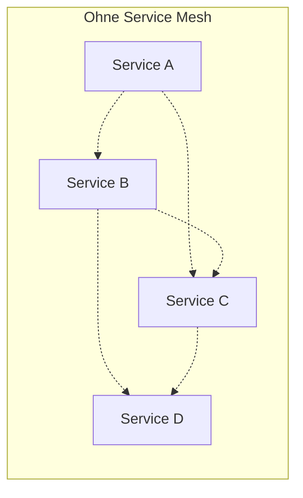
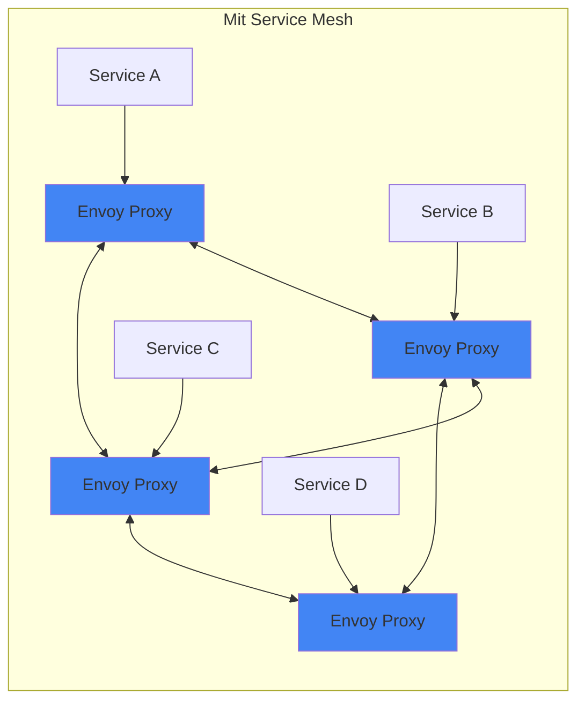

# Einführung in Istio & Service Mesh-Architekturen

**Was ist ein Service Mesh?**
- Dedizierte Infrastrukturschicht für Service-zu-Service-Kommunikation
- Transparente Zwischenschicht ohne Code-Änderungen
- Zentrale Steuerung von Retry, Timeout, Verschlüsselung, Monitoring

**Istio im Überblick:**
- Open-Source Service Mesh (Google, IBM, Lyft)
- Nutzt Envoy-Proxies als Sidecars
- Fängt gesamten Netzwerkverkehr ab


## Source 1:

```mermaid
graph TB
    subgraph "Ohne Service Mesh"
    direction LR
    A1[Service A] -.direkter Traffic.-> B1[Service B]
    A1 -.-> C1[Service C]
    B1 -.-> C1
    end
    
    subgraph "Mit Service Mesh - Sidecar Pattern"
    direction TB
    
    subgraph Pod1["Pod A"]
    direction LR
    SA[Service A] --> EA[EnvoySidecar]
    end
    
    subgraph Pod2["Pod B"]
    direction LR
    SB[Service B] --> EB[EnvoySidecar]
    end
    
    subgraph Pod3["Pod C"]
    direction LR
    SC[Service C] --> EC[EnvoySidecar]
    end
    
    EA |mTLS| EB
    EA |mTLS| EC
    EB |mTLS| EC
    end
    
    style EA fill:#4285f4
    style EB fill:#4285f4
    style EC fill:#4285f4
    style Pod1 fill:#e8f4f8
    style Pod2 fill:#e8f4f8
    style Pod3 fill:#e8f4f8
```


## Source / Mermaid 


    

