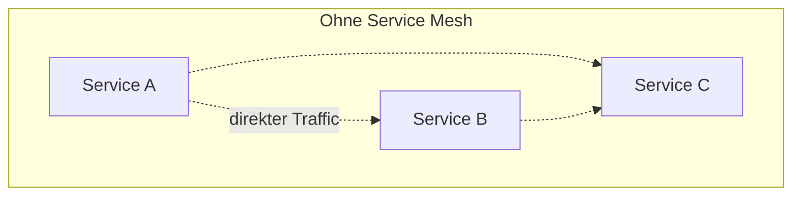
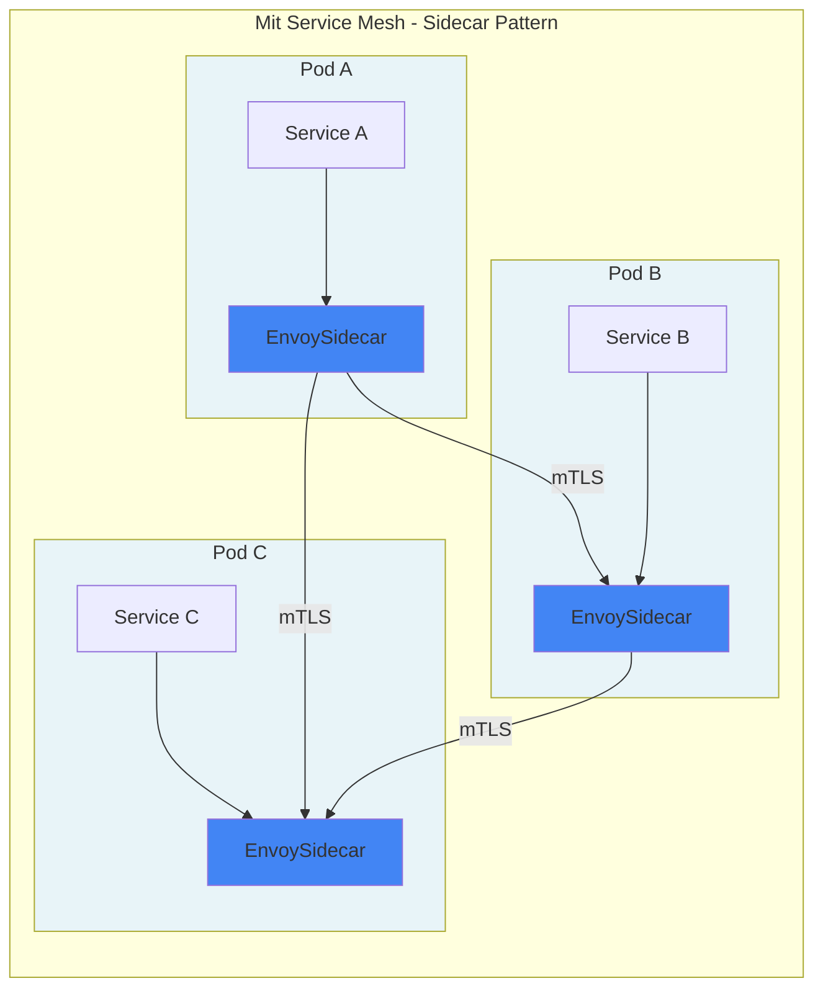

# Einführung in Istio & Service Mesh-Architekturen

**Was ist ein Service Mesh?**
- Dedizierte Infrastrukturschicht für Service-zu-Service-Kommunikation
- Transparente Zwischenschicht ohne Code-Änderungen
- Zentrale Steuerung von Retry, Timeout, Verschlüsselung, Monitoring

**Istio im Überblick:**
- Open-Source Service Mesh (Google, IBM, Lyft)
- Nutzt Envoy-Proxies als Sidecars
- Fängt gesamten Netzwerkverkehr ab

## Source 1:

