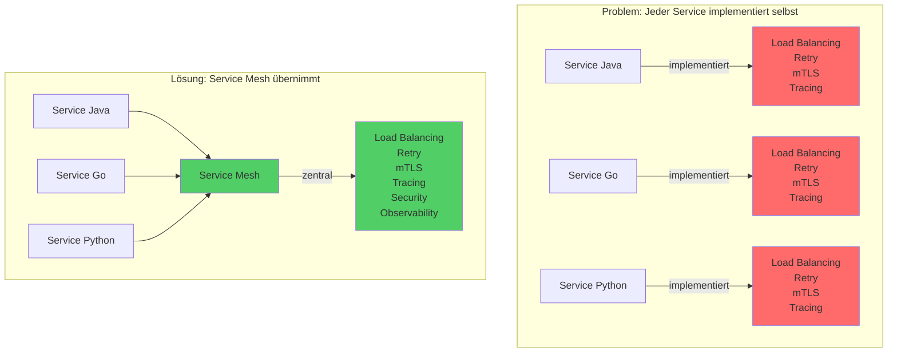

# Warum ein Service Mesh?

**Probleme in Microservices:**
- Dutzende/Hunderte Services → komplexe Kommunikation
- Jeder Service muss selbst implementieren:
  - Circuit Breaking
  - Load Balancing
  - mTLS-Verschlüsselung
  - Distributed Tracing
  - Retry-Logik
- Inkonsistente Implementierung über Sprachen hinweg
- Hoher Wartungsaufwand

**Lösung:**
- Komplexität aus Anwendungscode → Infrastruktur
- Platform-Teams: zentrale Policies
- Entwickler: Fokus auf Business-Logik
  

