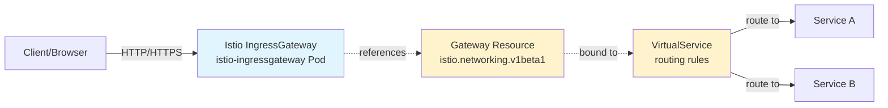

# Ingress Istio-Gateway vs. Kubernetes Gateway API 

```mermaid
graph LR
    Client[Client/Browser]
    IG[Istio IngressGateway<br/>istio-ingressgateway Pod]
    GW[Gateway Resource<br/>istio.networking.v1beta1]
    VS[VirtualService<br/>routing rules]
    SvcA[Service A]
    SvcB[Service B]
    
    Client -->|HTTP/HTTPS| IG
    IG -.->|references| GW
    GW -.->|bound to| VS
    VS -->|route to| SvcA
    VS -->|route to| SvcB
    
    style IG fill:#e1f5ff
    style GW fill:#fff3cd
    style VS fill:#fff3cd
```
